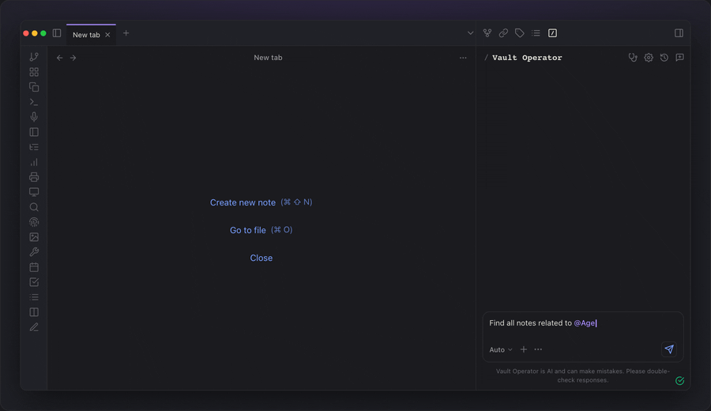

# Vault Operator

**An autonomous AI agent inside your Obsidian vault.**

You describe a task, it plans, searches, reads, writes, and reports back. Every action is visible. Every write needs your approval. Every change is undoable in one click.

Free. Open source. Local-first. Works with cloud models, with your existing ChatGPT or Copilot subscription, or fully offline with Ollama or LM Studio.

[Documentation](https://pssah4.github.io/vault-operator) | [Install from Obsidian](obsidian://show-plugin?id=vault-operator) | [Community page](https://community.obsidian.md/plugins/vault-operator)

<p align="center">
  
</p>

---

## Why this is more than a sidebar AI chat

A chatbot reads your prompt and answers. Vault Operator runs a loop: it picks tools, executes them against your vault, feeds the results back to the model, and continues until the task is done. That loop is the difference.

- **It acts on your vault, not just about it.** Reading, editing, creating, linking, refactoring. Not "here is what you could write", but the actual file in front of you.
- **It learns your vault structure.** Folders, wikilinks, frontmatter, tags, plugins. It uses what is there instead of starting from scratch every turn.
- **It learns you.** Three-tier memory across sessions: short-term session summaries, long-term durable facts, and a profile of how you write and how you like the agent to behave.
- **It works across your AI surfaces.** Runs as an MCP server so ChatGPT, Claude Desktop, or Perplexity can read the same memory and history as the in-Obsidian agent. One thread of thinking, regardless of which AI client captured the idea.
- **It picks the right model for each step.** Configure a provider once, the plugin sorts the models into Budget, Main, and Frontier tiers and routes work to the cheapest tier that still does the job.

---

## What it does for knowledge work

The plugin is built around the daily reality of a serious vault: capturing new sources without losing context, finding what you wrote six months ago, building documents from material you already have, and keeping the whole thing navigable as it grows.

### Capture sources with provenance

The most expensive failure mode in a knowledge vault is forgetting why you trusted a conclusion. A note without a path back to its source decays.

Vault Operator solves this with block-level provenance. Drop a PDF into the chat, ask for an ingest, and the agent runs a triage step (ten seconds, looks at vault, memory, and chat history before reading anything), then produces a clean source note. Every key claim ends with a `↗` link that resolves to the exact paragraph in the source. One click and you are back at the original wording.

Two paths:

- **`/ingest`** for quick capture. One drop, one approval, one note. About three minutes.
- **`/ingest-deep`** for sense-making. A guided seven-step dialog that asks which topics to extract and in what shape, then writes derived notes that all trace back to the source paragraph. Five to fifteen minutes for a real research paper.

[Sense-making tutorial](https://pssah4.github.io/vault-operator/tutorials/deep-ingest) | [Block-level provenance concept](https://pssah4.github.io/vault-operator/concepts/provenance)

### Search by meaning, not by filename

A local vector index over your vault, combined with full-text keyword search, graph expansion through wikilinks, and a local cross-encoder reranker. Ask "what do I know about X?" and the agent finds notes whose meaning is related, even if none of them contain the words you used.

The background analysis also surfaces note pairs that discuss similar topics without any wikilink between them. This is the moment most vaults reveal hidden structure.

[Knowledge discovery guide](https://pssah4.github.io/vault-operator/guides/knowledge-discovery)

### Build Word, Excel, and draft PPTX files (beta)

Turn project notes into a Word document, structured data into Excel, or meeting notes into a draft PowerPoint deck. DOCX and XLSX output is clean and reliable. PPTX is in beta: the plugin ships with three default themes and five layouts, but real corporate template cloning is not supported in this version. For client-facing decks, treat the generated file as a starting point and finish the polish manually.

[Office documents guide (beta details)](https://pssah4.github.io/vault-operator/guides/office-documents)

### Keep the vault navigable

The vault health check audits your knowledge graph for orphaned notes, broken links, missing backlinks, weak clusters, inconsistent tags, and over-connected hub notes. Findings come with actions: apply a mechanical fix, open a discussion with the agent, or dismiss. Every repair creates a checkpoint you can undo.

[Vault health check guide](https://pssah4.github.io/vault-operator/guides/vault-health)

### Stay in control

Vault Operator is fail-closed. Write operations need your approval unless you opted into auto-approve for that category. Every task creates checkpoints in a shadow git repository (separate from your own git history). Click "Undo all changes" in the chat and the files go back. Sensitive folders can be locked from the agent via a `.obsidian-agentignore` file.

[Safety and control guide](https://pssah4.github.io/vault-operator/guides/safety-control) | [Checkpoints concept](https://pssah4.github.io/vault-operator/concepts/checkpoints)

---

## Try it

1. **Install.** Obsidian Settings > Community Plugins > Browse > "Vault Operator" > Install + Enable.
2. **Add a provider.** Settings > Vault Operator > Providers > "+ Add provider". A free [Google AI Studio](https://aistudio.google.com/app/apikey) key is enough to try everything.
3. **Open the sidebar and ask a question.** "What are my most-linked notes?" works on any vault. The First-Run wizard walks you through the rest.

For semantic search and the ingest workflows, also configure an embedding model in Settings > Embeddings. The [Quick Start tutorial](https://pssah4.github.io/vault-operator/tutorials/getting-started) covers every step.

---

## Documentation

Full documentation lives at [pssah4.github.io/vault-operator](https://pssah4.github.io/vault-operator).

For end users:

- [Tutorials](https://pssah4.github.io/vault-operator/tutorials/getting-started). Step-by-step walkthroughs from first install to sense-making with `/ingest-deep`.
- [Guides](https://pssah4.github.io/vault-operator/guides/capabilities). Reference for daily work.
- [Reference](https://pssah4.github.io/vault-operator/reference/tools). Tools, providers, settings, troubleshooting.

For developers:

- [Codebase tour](https://pssah4.github.io/vault-operator/concepts/codebase-tour). Directory layout, reading order, Kilo Code heritage.
- [Concepts](https://pssah4.github.io/vault-operator/concepts/). Agent loop, governance, knowledge layer, memory system, MCP architecture.

---

## Building from source

```bash
git clone https://github.com/pssah4/vault-operator.git
cd vault-operator
npm install
npm run build
```

Then copy `main.js`, `manifest.json`, and `styles.css` from the repo root into `<vault>/.obsidian/plugins/vault-operator/`. For watch mode + auto-deploy during development, point `PLUGIN_DIR` in `.env` at your test vault and run `npm run dev`.

Requirements: Obsidian 1.4+ (1.8+ for Bases features), desktop only, Node.js 18+ for building.

---

## Network usage and local capabilities

Vault Operator is local-first. No telemetry, no analytics, no accounts.

The plugin makes network requests in three situations, all under your control:

- **LLM API calls** to the provider you configured (Anthropic, OpenAI, Google, AWS Bedrock, OpenRouter, Azure, GitHub Copilot OAuth, ChatGPT OAuth, Kilo Gateway, Ollama, LM Studio, or any OpenAI-compatible endpoint).
- **Web search** (optional, disabled by default) when you use the `web_search` tool, going to Brave or Tavily.
- **MCP servers** you connected explicitly, plus the optional remote-MCP relay if you want cross-surface workflows with ChatGPT or Claude Desktop.

The plugin also uses a few Node.js capabilities that go beyond the standard Obsidian API: filesystem access for the local knowledge database and the office document pipeline, shadow git for checkpoints, sandbox process spawning for `evaluate_expression`, and optional LibreOffice spawning for presentation rendering. All writes stay under the vault path or the plugin data directory. Commands are fixed binaries with structured arguments; the agent does not construct shell commands from chat text.

API keys are encrypted via Electron's `safeStorage` (OS keychain on macOS, Credential Manager on Windows, libsecret on Linux). Where `safeStorage` is not available, keys fall back to plain plugin settings.

---

## License

Apache 2.0.

## Acknowledgements

- [Kilo Code](https://kilocode.ai) for architectural inspiration.
- [Obsidian](https://obsidian.md) as the platform.
- [sql.js](https://github.com/sql-js/sql.js) for SQLite in WebAssembly powering the knowledge layer.
- [Hugging Face Transformers.js](https://github.com/huggingface/transformers.js) for local ONNX reranking.
- [isomorphic-git](https://isomorphic-git.org) for pure-JS git checkpoints.
- [MCP SDK](https://github.com/modelcontextprotocol/typescript-sdk) for the Model Context Protocol.
