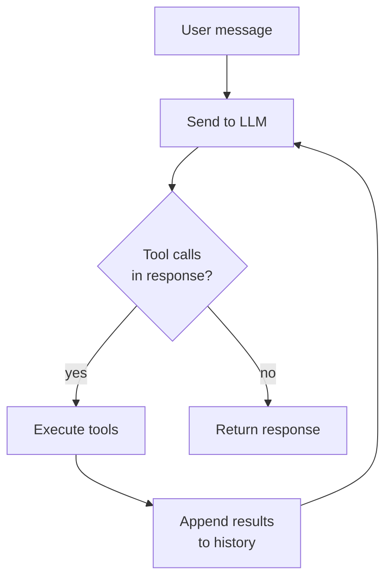
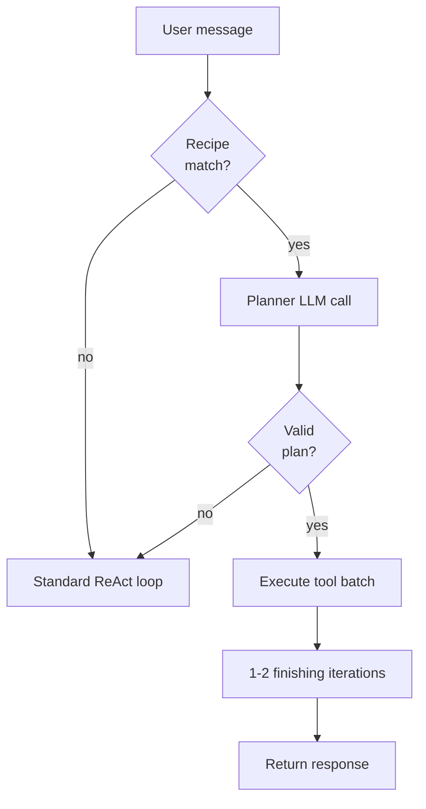

# The agent loop

A chatbot responds once. An agent loops. That distinction is the main thing to understand about Vault Operator.

When you send a message, Vault Operator passes it to the language model along with a system prompt and tool definitions. The model responds with text, tool calls, or both. If there are tool calls, Vault Operator executes them, appends the results to the conversation history, and sends everything back to the model. This repeats until the model responds with only text, calls `attempt_completion`, or a safety limit stops the loop.

The entire loop lives in one file: `src/core/AgentTask.ts`.

## The loop, visually

That's it. Everything else on this page is about controlling, protecting, and extending this loop.

## What happens at each step

The loop starts by assembling a system prompt from 16 modular sections: mode definition, available tools, active rules, loaded skills, memory context, and a few others. The system prompt is cached and only rebuilt when something changes, for example a mode switch or a tool availability toggle.

The assembled prompt and conversation history go to the AI provider. Vault Operator streams the response, firing `onText()` for each text chunk and collecting any `tool_use` blocks.

If the response contains tool calls, each one goes through `ToolExecutionPipeline` (`src/core/tool-execution/ToolExecutionPipeline.ts`). The pipeline validates paths, checks approval requirements, creates checkpoints before write operations, executes the tool, and logs the result. No tool bypasses this pipeline, not even MCP tools from external servers.

Read-only tools from the parallel-safe set (`read_file`, `search_files`, `semantic_search` and a few more) run concurrently via `Promise.all()`. Write tools and control-flow tools run one at a time.

The tool results go back into the conversation history as structured result blocks. The loop then sends the updated history to the model for the next iteration.

When the model responds with only text and no tool calls, or when it calls `attempt_completion`, the loop ends and the response goes back to the UI.

## AgentTask constructor

`AgentTask` takes 12 parameters that control loop behavior.

| Parameter | Default | What it does |
|-----------|---------|-------------|
| `api` | required | AI provider handler (Anthropic or OpenAI) |
| `toolRegistry` | required | Central tool registry |
| `taskCallbacks` | required | UI callbacks for text, tool events, completion |
| `modeService` | optional | Mode switching and web-tools toggle |
| `consecutiveMistakeLimit` | `0` (off) | Abort after N consecutive tool errors |
| `rateLimitMs` | `0` (off) | Minimum milliseconds between iterations |
| `condensingEnabled` | `true` | Automatic context condensing |
| `condensingThreshold` | `70` | Condense when tokens exceed this % of context window |
| `powerSteeringFrequency` | `0` (off) | Re-inject mode instructions every N iterations |
| `maxIterations` | `25` | Hard cap on loop iterations |
| `depth` | `0` | Current sub-agent nesting depth |
| `maxSubtaskDepth` | `2` | Maximum nesting depth for spawned child agents |

The `run()` method takes a config object with the user message, task ID, initial mode, conversation history, and optional context like rules, skills, and memory.

## Fast path execution

Not every task needs the full ReAct loop. When the agent has solved the same kind of task before, it can skip most of the iterative reasoning and execute a pre-planned sequence of tool calls. This is the fast path, and it is the single biggest token-cost optimization in the system.

The fast path depends on the recipe system (see [memory](./memory-system)). When a user message arrives, `RecipeMatchingService` checks whether a matching recipe exists. If one matches and has been used successfully at least three times, the fast path activates:

1. A single planner LLM call receives the user message plus the recipe and produces a concrete execution plan, a JSON array of tool calls with parameters.
2. The plan gets executed deterministically through the same `ToolExecutionPipeline`, without further LLM calls. Read operations run in parallel, writes sequentially.
3. The normal agent loop then takes over for one or two final iterations to formulate the response.

Instead of eight LLM calls and 634,000 tokens, the fast path typically needs two to three calls and about 70,000 tokens.

The fast path has guardrails. If the planner produces invalid JSON or references unknown tools, the system falls back to the standard ReAct loop. All tool invocations still pass through `ToolExecutionPipeline` with approval checks, checkpoints, and logging. No governance is bypassed.

## Context externalization

Tool results accumulate in the conversation history and are resent with every API call. A semantic search returns 20,000 characters. Reading a note adds another 20,000. After eight iterations, tool results alone can exceed 250,000 tokens.

Context externalization intercepts large tool results before they enter the history. When a result exceeds 2,000 characters, the full content gets written to a temporary file. The history receives a compact reference describing what was found, the top entries with relevance scores, and the file path where the full data lives.

`ResultExternalizer` (`src/core/tool-execution/ResultExternalizer.ts`) handles this, called from `ToolExecutionPipeline` after each tool execution. Externalization is transparent to tools. They return full results as before, and the pipeline decides what enters the history.

Temporary files live in `.vault-operator/tmp/{taskId}/` with deterministic names (`{toolName}-{callIndex}.md`). No timestamps, no random values, so file paths don't invalidate the KV cache. Cleanup happens after task completion, with a safety sweep on plugin startup for orphaned directories older than one hour.

During fast path execution, externalization is disabled. The final LLM call needs full content for a good summary, and with only two to three iterations the accumulation is minimal.

The history is strictly append-only. Externalization happens at result creation time, never retroactively. KV caching and context condensing share this principle. Neither works if the history gets modified after the fact.

## Safety rails

The loop has several mechanisms to stop runaway behavior.

Iteration limits. A soft limit at 60% of `maxIterations` and a hard limit at `maxIterations` (default 25). At the soft limit, the agent receives a warning to wrap up. At the hard limit, the loop terminates unconditionally.

Consecutive mistake tracking. Every tool error increments a counter. A successful call resets it to zero. If the counter reaches `consecutiveMistakeLimit`, the loop aborts. This stops the agent from burning tokens on a broken approach.

Tool repetition detection. `ToolRepetitionDetector` keeps a sliding window of the last 15 tool calls. If the same tool with identical input appears 3 or more times, it gets blocked. For search tools, the detector also catches semantically similar queries using Jaccard similarity. Blocked calls return recoverable errors so the agent can try something different.

Rate limiting. When `rateLimitMs` is set, each iteration pauses for at least that many milliseconds. A simple throttle for API cost control.

## Context condensing

Language models have finite context windows. A long conversation with many tool calls fills up fast. Context condensing handles this.

When `condensingEnabled` is true and the estimated token count exceeds `condensingThreshold` percent of the model's context window, condensing triggers. First, `onPreCompactionFlush` fires so important facts can be persisted to memory before trimming. Then the conversation history is summarized into a compact representation that replaces the original messages.

If the API returns a 400-class error indicating context overflow, emergency condensing kicks in regardless of the threshold. The threshold then resets to 80% to avoid triggering repeatedly.

## Power steering

Models drift. In a long loop with many iterations, the agent can gradually forget its assigned role and start behaving generically. Power steering counters this.

When `powerSteeringFrequency` is set to a value like 4, the loop injects a synthetic user message every 4 iterations. This message reminds the model of its active mode, role definition, and active skill names. It doesn't cost an extra API call. It is just an additional message in the conversation history before the next iteration.

## Multi-agent: spawning child agents

The `new_task` tool lets the agent spawn a child `AgentTask` for a subtask. The child gets a fresh conversation history (no parent context leaks), its own mode, and a depth counter incremented by one. Condensing and power steering are disabled for children to keep them lean.

The parent's approval callback is forwarded to the child, so write operations from child agents still require human approval.

When a child reaches `maxSubtaskDepth` (default 2), the `new_task` tool is removed from its available tools entirely, which prevents unbounded recursive spawning. Token usage from children accumulates into the parent's totals for accurate cost tracking.

`new_task({profile: 'research'})` is the lean variant. It spawns a research-only subagent with a read-only tool allowlist (10 schemas instead of 34 in main) and a per-call token budget (default 8000). The role definition requires the subagent to put the concrete output the parent asked for into `attempt_completion.result`, not a meta-acknowledgement. This keeps the parent's context flat after the subtask returns.

## Advisor escalation: `consult_flagship`

The loop runs on the Main tier of the active provider by default. When the agent hits a hard synthesis step it can call `consult_flagship` to ask the Frontier-tier model a focused question. The advisor subagent is read-only (no write, edit, delete, MCP, or spawn), output is capped at 3000 tokens, and the per-task budget is three calls. The tool is filtered out of the schema entirely if the active provider has no Frontier slot.

See [Advisor pattern](./advisor-pattern) for the full story.

## Helper-model routing

Four internal LLM calls do not run on the main chat model:

- Context condensing
- Fast-path planning (the planner that turns a recipe match into a deterministic tool sequence)
- `plan_presentation` (the internal LLM call inside the `create_pptx` template flow)
- Recipe promotion (the call that decides whether a finished task qualifies as a reusable recipe)

All four route to the `helperModelKey` provider/model pair from Settings > Agent behaviour > Loop > Helper model. Fail-closed: if the setting is invalid the helper calls fall back to the main model. Pick the cheapest model that still understands the prompts (Claude Haiku, GPT-4o-mini, Gemini Flash, local Ollama). The helper is invisible to the user-visible turn; you only see it in the cost log.

## Next

Continue to the [tool system](./tool-system) to see how tools are registered, validated, and executed through the governance pipeline.
