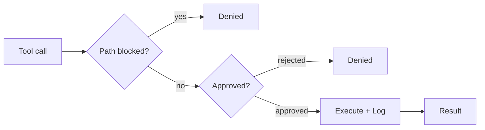

# Governance

This is what makes it safe to give an AI write access to your notes.

The principle is fail-closed. If anything goes wrong during an approval check, whether a missing callback, unloaded config, or unexpected error, the operation is denied. The agent never silently auto-approves. Every tool call, internal or MCP, flows through one central pipeline.

## The pipeline

`ToolExecutionPipeline` (`src/core/tool-execution/ToolExecutionPipeline.ts`) is the single enforcement point. Nothing bypasses it.

Three questions, in order: Is the path allowed? Is the operation approved? Only then does the tool run. After execution, the result is logged.

## Path protection

Two files in the vault root control which paths the agent can access:

| File | Effect |
|------|--------|
| `.obsidian-agentignore` | Paths completely invisible to the agent. Uses gitignore syntax. |
| `.obsidian-agentprotected` | Paths readable but never writable, even with explicit approval. |

Both files use glob patterns. A line like `journal/private/**` blocks everything under that folder.

Some paths are always blocked regardless of configuration: `.git/`, Obsidian workspace files, and cache files. The governance config files themselves are always write-protected, so the agent cannot edit its own restrictions.

The `IgnoreService` (`src/core/governance/IgnoreService.ts`) enforces this. If it hasn't finished loading its patterns yet, it denies all access. Fail-closed, as always.

## Approval categories

Every tool is classified into an approval group. The group determines whether the operation runs automatically or needs human consent.

| Group | Examples | Default behavior |
|-------|----------|-----------------|
| `read` | read_file, search_files, semantic_search | Auto-approved |
| `note-edit` | write_file, edit_file, append_to_file | Requires approval |
| `vault-change` | create_folder, delete_file, move_file | Requires approval |
| `web` | web_fetch, web_search | Auto-approved when web tools are enabled |
| `agent` | attempt_completion, switch_mode, update_todo_list | Always auto-approved |
| `subtask` | new_task | Configurable |
| `mcp` | use_mcp_tool | Configurable |
| `skill` | execute_command, call_plugin_api | Configurable |
| `sandbox` | evaluate_expression | Requires explicit opt-in |
| `self-modify` | manage_skill, manage_source | Always requires human approval, no bypass |

Self-modification tools are the strictest category. The agent can create and edit its own skills and source code, but a human must approve every change. There is no auto-approve setting for this group.

For note edits, the approval UI can show a semantic diff grouped by Markdown structure (frontmatter, headings, lists, code blocks) rather than raw line hunks. You can approve, reject, or edit individual sections before confirming.

## Checkpoints

Before any write operation, the pipeline takes a git snapshot of the affected file. This uses a shadow repository at `.obsidian/plugins/obsilo-agent/checkpoints/` powered by `isomorphic-git` (pure JavaScript, no native git binary needed).

`GitCheckpointService` (`src/core/checkpoints/GitCheckpointService.ts`) commits the file's current content into the shadow repo before the tool modifies it. Each checkpoint records the task ID, commit hash, timestamp, changed files, and the tool that triggered it. Files that didn't exist before the checkpoint are tracked separately so restore can delete them.

The result: after any task, you can undo all changes. The undo is granular: each write operation gets its own checkpoint, so you can roll back to any intermediate state. The vault's own git history (if it has one) is never touched.

## Audit log

Every tool call is logged to a JSONL file via `OperationLogger` (`src/core/governance/OperationLogger.ts`). One file per day, stored at `.obsidian/plugins/obsilo-agent/logs/YYYY-MM-DD.jsonl`. Files older than 30 days are automatically deleted.

Each entry records:

| Field | Content |
|-------|---------|
| `timestamp` | ISO 8601 |
| `taskId` | Which task triggered the call |
| `mode` | Active mode at the time |
| `tool` | Tool name |
| `params` | Input parameters (PII-scrubbed) |
| `result` | Output summary (capped at 2000 chars) |
| `success` | Whether the call succeeded |
| `durationMs` | Execution time |

Sensitive values (passwords, tokens, API keys) are replaced with `[REDACTED]` before logging. File content fields are logged as `[N chars]` rather than the full text. URLs have credentials stripped.

The log is append-only during a session. You can read it with any tool that understands JSONL, or use the built-in `read_agent_logs` tool to have the agent analyze its own history.
