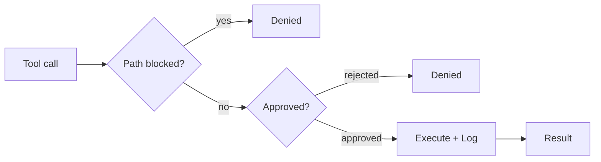

# Governance

This is what makes it safe to give an AI write access to your notes.

The principle is fail-closed. If anything goes wrong during an approval check (a missing callback, an unloaded config, an unexpected error), the operation is denied. The agent never silently auto-approves. Every tool call, internal or MCP, flows through one central pipeline.

## The pipeline

`ToolExecutionPipeline` (`src/core/tool-execution/ToolExecutionPipeline.ts`) is the single enforcement point. Nothing bypasses it.

Three questions, in order. Is the path allowed? Is the operation approved? Only then does the tool run, and the result is logged afterward.

## Path protection

Two files in the vault root control which paths the agent can access:

| File | Effect |
|------|--------|
| `.obsidian-agentignore` | Paths completely invisible to the agent. Uses gitignore syntax. |
| `.obsidian-agentprotected` | Paths readable but never writable, even with explicit approval. |

Both files use glob patterns. A line like `journal/private/**` blocks everything under that folder.

Some paths are always blocked regardless of configuration: `.git/`, Obsidian workspace files, and cache files. The governance config files themselves are always write-protected, so the agent cannot edit its own restrictions.

The `IgnoreService` (`src/core/governance/IgnoreService.ts`) enforces this. If it hasn't finished loading its patterns yet, it denies all access. Fail-closed.

## Approval categories

Every tool call routes through the auto-approval check. The pipeline classifies the call into one of twelve approval groups, then looks up the matching toggle under Settings > Vault Operator > Agents > Auto-approve. If the toggle is on, the call runs without asking. If it is off, the approval modal opens.

| Group | Examples | Default behaviour |
|-------|----------|-------------------|
| `read` | `read_file`, `search_files`, `semantic_search`, `read_document` | Auto-approved when the read toggle is on |
| `note-edit` | `write_file`, `edit_file`, `append_to_file`, `update_frontmatter`, `ingest_document`, `ingest_deep`, `ingest_triage` | Requires approval unless the note-edits toggle is on |
| `vault-change` | `create_folder`, `delete_file`, `move_file`, `create_pptx`, `create_docx`, `create_xlsx`, `restore_checkpoint` | Requires approval unless the vault-changes toggle is on |
| `web` | `web_fetch`, `web_search`, `anti_echo_search` | Auto-approved when the web toggle is on |
| `agent` | `attempt_completion`, `switch_agent`, `update_todo_list`, `find_tool`, `inspect_self`, `update_settings` | Always auto-approved |
| `subtask` | `new_task` | Auto-approved when the subtasks toggle is on |
| `mcp` | `use_mcp_tool` | Auto-approved when the MCP toggle is on |
| `skill` | `execute_command`, `invoke_skill`, `run_skill_script`, `enable_plugin` | Auto-approved when the skills toggle is on |
| `plugin-api` | `call_plugin_api` | Two toggles, one for read calls and one for write calls. The pipeline picks the toggle based on the call shape. |
| `recipe` | `execute_recipe` | Auto-approved when the recipes toggle is on |
| `sandbox` | `evaluate_expression` | Always asks. No auto-approve toggle. |
| `self-modify` | `manage_source`, `update_soul` | Always asks. No auto-approve toggle, no bypass. |

The triage tool (`ingest_triage`) lives in the `note-edit` group because it writes the triage decision back into the source note frontmatter. The single-pass and deep ingest paths are also `note-edit`. There is no separate `ingest` group.

Self-modification is the strictest category. The agent can edit its own source code and settings, but a human approves every change. Skill authoring goes through the built-in skill-creator skill plus the regular file tools (`write_file`, `edit_file`), so each new `SKILL.md` still passes through note-edit approval.

For note edits, the approval modal can show a semantic diff grouped by Markdown structure (frontmatter, headings, lists, code blocks) instead of raw line hunks. You can approve, reject, or edit individual sections before confirming.

## Checkpoints

Before any write operation, the pipeline takes a git snapshot of the affected file. This uses a shadow repository at `{vault-parent}/vault-operator-shared/checkpoints/` (outside the vault, so Obsidian Sync and iCloud do not replicate it) powered by `isomorphic-git` (pure JavaScript, no native git binary needed).

`GitCheckpointService` (`src/core/checkpoints/GitCheckpointService.ts`) commits the file's current content into the shadow repo before the tool modifies it. Each checkpoint records the task ID, commit hash, timestamp, changed files, and the tool that triggered it. Files that didn't exist before the checkpoint are tracked separately so restore can delete them.

After any task, you can undo all changes. Every write operation gets its own checkpoint, so you can roll back to any intermediate state. The vault's own git history, if it has one, is never touched.

## Audit log

Every tool call is logged to a JSONL file via `OperationLogger` (`src/core/governance/OperationLogger.ts`). One file per day, stored under the agent folder at `.vault-operator/data/logs/YYYY-MM-DD.jsonl`. Files older than 30 days get deleted automatically.

Each entry records:

| Field | Content |
|-------|---------|
| `timestamp` | ISO 8601 |
| `taskId` | Which task triggered the call |
| `mode` | Active mode at the time |
| `tool` | Tool name |
| `params` | Input parameters (PII-scrubbed) |
| `result` | Output summary (capped at 2000 chars) |
| `success` | Whether the call succeeded |
| `durationMs` | Execution time |

Sensitive values (passwords, tokens, API keys) are replaced with `[REDACTED]` before logging. File content fields are logged as `[N chars]` instead of the full text. URLs have credentials stripped.

The log is append-only during a session. You can read it with any tool that understands JSONL, or use the built-in `read_agent_logs` tool to have the agent analyze its own history.
