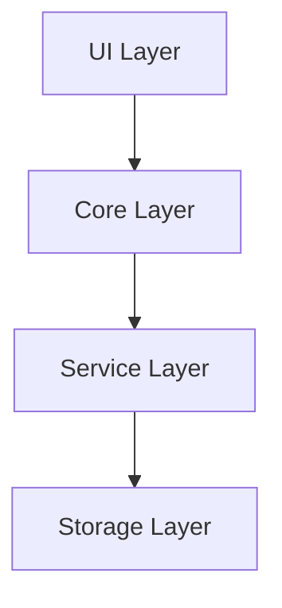

# How Vault Operator works

Vault Operator is an AI agent that runs inside Obsidian as a community plugin. You send it a message, it calls tools to read and change your vault, and it loops until the task is done. That loop, and the infrastructure around it, is what this section explains.

The Concepts section is for two kinds of readers. If you use Vault Operator daily and want to understand what is happening under the hood (so you can predict it, debug it, or trust it more), every page here is written for you in plain language. If you are a developer who wants to read the source or build on top of it, start with the [codebase tour](./codebase-tour) and the deeper architecture pages.

## The mental model

Forget chat interfaces for a moment. A chatbot takes your message, generates a response, and stops. Vault Operator does something different. It takes your message, generates a response that may include tool calls (read a file, run a search, edit a note), executes those tools, feeds the results back to the language model, and repeats. The loop continues until the model decides it has finished or a safety limit cuts it off.

That loop is the entire architecture. Everything else (the approval system, the prompt assembly, the memory layer, the agent system) exists to make that loop safe and extensible.

## Layers

Vault Operator has four layers. Each depends only on the layer below it.

The UI layer is the sidebar, settings panel, and modals. It sends user messages down and renders whatever comes back up.

The core layer is where the agent loop lives. It orchestrates the conversation, governs every tool call, and assembles the system prompt that tells the model what it can do.

The service layer contains domain logic: semantic search, memory, MCP integration, office document generation, the skill system, the code sandbox. The core layer calls into these services when it executes tools.

The storage layer is Obsidian's vault. All reads and writes go through the vault API, never through raw filesystem calls. This keeps Vault Operator compatible with Obsidian sync, indexing, and the rest of the plugin ecosystem.

## Design principles

**Local first.** Your data never leaves your machine except for API calls to the AI provider you configured. No cloud services, no telemetry, no accounts.

**Fail-closed safety.** Write operations require explicit user approval by default. If the approval callback is missing or broken, the pipeline rejects the operation. This logic lives in one place, so no single tool can bypass it.

**A platform, not a fixed feature set.** You can extend Vault Operator with MCP servers for external tools, write your own skills to teach the agent new behaviors, and use the sandbox to run code at runtime. The agent can inspect its own logs and even create new skills, always under your supervision.

## Where to read next

If you are a daily user who wants to know what is going on, start with the [agent loop](./agent-loop). It explains how one message becomes a multi-step task and is the most useful page in this section. From there:

- [Block-level provenance](./provenance) explains the link-back system that ties every claim to its source paragraph.
- [Checkpoints and undo](./checkpoints) explains how Vault Operator records vault changes so you can roll them back.
- [Memory](./memory-system) covers how the agent remembers you across sessions.

If you are a developer who wants to read the code or build extensions, the [codebase tour](./codebase-tour) walks the directory layout, the Kilo Code heritage, and where to start reading.
