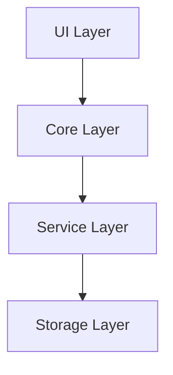

# How Vault Operator works

Vault Operator is an AI agent that runs inside Obsidian as a community plugin. You send it a message, it calls tools to read and change your vault, and it loops until the task is done. That loop, and the infrastructure around it, is what this section explains.

## The mental model

Forget chat interfaces for a moment. A chatbot takes your message, generates a response, and stops. Vault Operator does something different. It takes your message, generates a response that may include tool calls (read a file, run a search, edit a note), executes those tools, feeds the results back to the language model, and repeats. The loop continues until the model decides it has finished or a safety limit cuts it off.

That loop is the entire architecture. Everything else, the approval system, the prompt assembly, the memory layer, the mode system, exists to make that loop safe and extensible.

## Layers

Vault Operator has four layers. Each depends only on the layer below it.

The UI layer is the sidebar, settings panel, and modals. It sends user messages down and renders whatever comes back up.

The core layer is where the agent loop lives. `AgentTask` orchestrates the conversation, `ToolExecutionPipeline` governs every tool call, and the system prompt builder assembles the instructions that tell the model what it can do.

The service layer contains domain logic: semantic search, memory, MCP integration, office document generation, the skill system, the code sandbox. The core layer calls into these services when it executes tools.

The storage layer is Obsidian's vault. All reads and writes go through `app.vault` and `app.fileManager`, never through raw filesystem calls. This keeps Vault Operator compatible with Obsidian sync, indexing, and the rest of the plugin ecosystem.

## Design principles

Vault Operator is local-first. Your data never leaves your machine except for API calls to the AI provider you configured. No cloud services, no telemetry, no accounts.

The safety model is fail-closed. Write operations require explicit user approval by default. If the approval callback is missing or broken, the pipeline rejects the operation. This logic lives in `ToolExecutionPipeline`, not in individual tools, so no single tool can bypass it.

The plugin is a platform. You can extend it with MCP servers for external tools, write your own skills to teach the agent new behaviors, and use the sandbox to run code at runtime. The agent can inspect its own logs and create new skills, but always under your supervision.

## Directory structure

| Directory | What's in it |
|-----------|-------------|
| `src/core/` | AgentTask, pipeline, system prompt, modes, governance, checkpoints |
| `src/core/tools/` | 66 tool implementations (vault, web, agent, memory, MCP, dynamic) |
| `src/core/tool-execution/` | Execution pipeline, repetition detector, operation logger |
| `src/core/prompts/sections/` | 16 modular prompt section builders |
| `src/core/memory/` | Memory v2 layer (FactStore, RecipeStore, soul, source-interface tagging) |
| `src/core/knowledge/` | Knowledge graph, ontology, BA-25 auto-summary and tension detection |
| `src/core/ingest/` | Karpathy-style deep ingest pipeline, triage, block-id mirror, source-position annotator |
| `src/mcp/` | MCP server (cross-surface read/write to memory, history, vault) and Cloudflare relay |
| `src/api/` | AI provider abstraction (Anthropic, OpenAI, Bedrock, Gemini, Copilot, Kilo Gateway, OpenRouter) |
| `src/ui/` | Sidebar, settings, modals, onboarding |
| `src/i18n/` | Internationalization (EN, DE) |
| `src/types/` | Shared TypeScript types and settings |

## Kilo Code heritage

Vault Operator's core loop and tool architecture are adapted from Kilo Code, an open-source AI coding agent. The adaptation replaces filesystem operations with Obsidian's vault API, adds governance layers for approval and checkpointing, and introduces domain-specific tools for knowledge management.

## Where to read next

Start with the [agent loop](./agent-loop). It is the most important page in this section, and it explains how a message becomes a multi-step task. From there, the [tool system](./tool-system) covers how tools are registered, validated, and executed. The [governance page](./governance) explains the approval and safety model.
