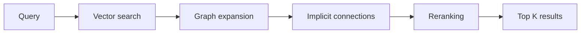

# Knowledge layer

A vault can hold thousands of notes. The agent's context window fits maybe a dozen. The knowledge layer bridges that gap. Given a query, it finds the most relevant notes without calling any external API.

Everything runs locally, including the vector math, the graph traversal, and the reranking model. Your data never leaves the device.

## The problem

Keyword search misses semantic matches. A note titled "Project retrospective" won't match a query about "what went wrong last quarter" even though it is exactly what you need. And even with good candidates, you still miss notes that are *related to* those candidates through links and tags.

Full-text search has a breadth problem too. It tells you which notes contain a word, but not which notes are conceptually relevant. A note about "quarterly review process" might be what you want when asking about retrospectives, but it shares zero keywords with the query. The knowledge layer handles both: semantic similarity for meaning, graph traversal for context.

## The 4-stage pipeline

Each stage adds candidates that the previous stages would miss.

Stage 1 is vector search. The query is embedded into a vector using your configured embedding model, then compared against pre-computed chunk vectors via cosine similarity. This finds semantically similar content regardless of wording. A query about "team morale" matches notes about "employee satisfaction" because the vectors are close in embedding space.

Notes are split into chunks before embedding. Each chunk gets its own row in the `vectors` table. The chunking happens during indexing, not at query time, so search is fast even on large vaults.

Stage 2 is graph expansion. The initial vector results are seed nodes. The system follows Wikilinks and frontmatter properties outward via breadth-first search. If your "Q3 retrospective" note links to "Action items" and "Team feedback", those get pulled in too. The `GraphStore` (`src/core/knowledge/GraphStore.ts`) handles the BFS traversal over the `edges` table, tracking hop distance so closer neighbors rank higher.

Each edge carries a confidence score. Wikilinks get the highest confidence because you placed them intentionally. MOC property links (frontmatter fields like `related` or `parent`) get medium confidence. Implicit connections discovered by semantic similarity get the lowest. These scores affect how much weight an expanded neighbor gets in the final ranking.

The graph also tracks modification time. A note you edited yesterday gets a small relevance boost over one you haven't touched in months. This keeps current knowledge visible without burying older notes.

On top of the edge graph sits a second structure, topic clusters. At startup, `CommunityDetectionService` runs the Louvain algorithm (via the `graphology` library) over the wikilink and frontmatter graph and groups notes into emergent communities. A community is a set of notes that link to each other densely but connect sparsely to the rest of the vault. The clusters aren't predefined. They fall out of the graph's structure. Retrieval uses cluster membership as an additional ranking signal, and the vault health check uses it to spot notes whose declared category disagrees with the cluster they actually belong to.

The graph distinguishes body links (Wikilinks in note content) from frontmatter links (properties like `related`, `parent`, or custom MOC fields). Both contribute to expansion, but they are stored with different `link_type` values so the system can weight them differently.

Stage 3 is implicit connections. Some notes are similar but have no explicit link between them. The `ImplicitConnectionService` (`src/core/knowledge/ImplicitConnectionService.ts`) pre-computes these pairs in a background job by comparing vectors across the vault and storing high-similarity pairs. During retrieval, if any candidate has an implicit connection to another note, that note joins the pool.

This stage is what separates the knowledge layer from a standard search engine. It surfaces relationships that exist semantically but not structurally. You might have two meeting notes from different projects that discuss the same technical problem. No link between them, no shared tags, but the implicit connection picks them up. The `dismissed_pairs` table lets you prune false positives. If the system keeps surfacing a pair that isn't actually related, you can dismiss it.

Stage 4 is reranking. All candidates from the first three stages are re-scored by a local cross-encoder model (Xenova/ms-marco-MiniLM-L-6-v2 via transformers.js WASM). Unlike the embedding model, which encodes query and document separately, the cross-encoder processes the pair together and produces a more accurate relevance score. The `RerankerService` (`src/core/knowledge/RerankerService.ts`) downloads the model from HuggingFace on first use and caches it locally.

The cross-encoder is small (about 80 MB) and runs entirely on CPU via WASM. First-time download takes a few seconds. After that it loads from the local cache in under a second.

## Indexing

The knowledge layer is only as good as its index. Vault events (file create, modify, delete, rename) trigger re-indexing through a debounced listener in `main.ts`. The debounce groups rapid changes into a single indexing pass. When a file changes, only its chunks are re-embedded. The rest of the index stays untouched.

The graph (edges and tags) is re-extracted on each index run. This is fast because it reads Obsidian's metadata cache instead of parsing Markdown directly. Implicit connections are recomputed less frequently as a background job after the main indexing pass, because comparing every vector pair is more expensive.

## Storage

Everything lives in a single SQLite database managed by `KnowledgeDB` (`src/core/knowledge/KnowledgeDB.ts`), running via sql.js (WASM SQLite compiled to JavaScript). No native addons, no Electron rebuild needed.

| Table | Purpose | Key columns |
|-------|---------|-------------|
| `vectors` | Chunk embeddings | `path`, `chunk_index`, `text`, `vector` (Float32Array BLOB), `enriched`, `embedding_model` |
| `edges` | Wikilinks and frontmatter properties | `source_path`, `target_path`, `link_type` |
| `tags` | Note tags | `path`, `tag` |
| `implicit_edges` | Pre-computed similar pairs | `source_path`, `target_path`, `similarity` |
| `dismissed_pairs` | User-dismissed implicit connections | `path_a`, `path_b` |
| `cluster_source_stats` | Source-domain diversity per cluster | `cluster_id`, `domain`, `count`, `last_seen` |
| `ingest_triage_log` | Triage decisions per source URI (FEAT-19-12) | `source_uri`, `decision`, `cluster_match`, `created_at` |

The database supports three storage locations with a fallback chain:
- Global: `~/.obsidian-agent/knowledge.db` (shared across vaults, desktop only)
- Local: `{vault}/.obsidian-agent/knowledge.db`
- Obsidian Sync: `{vault}/{pluginDir}/knowledge.db`

The schema is versioned (currently v10). When a schema change ships, `KnowledgeDB` runs migration logic on open. Daily snapshots in `.bak/{name}/{YYYY-MM-DD}.db` provide a 7-day recovery window if a write goes wrong, and a lock file prevents two plugin instances from corrupting the same database. Atomic writes plus a multi-file commit journal keep the database consistent across both `global` and `local`/`obsidian-sync` storage modes (FEATURE-0314).

## The ontology store

Next to the vectors and the edge graph sits a small third store, the ontology. `OntologyStore` (`src/core/knowledge/OntologyStore.ts`) tracks the conceptual schema that emerges from your vault: which category labels exist, which entity clusters repeat, which type hierarchies the notes fall into. It is populated automatically during indexing, not curated by hand.

Three features rely on it. The knowledge ingest workflow uses the ontology to prefer existing entities over creating new ones, and the `ingest_triage` tool consults it to score a new source against your existing topic clusters before any expensive reading happens. The vault health check uses the ontology to validate each note's category property against the cluster it belongs to, which is how category mismatches get flagged. And the BA-25 maintenance pipeline (next section) reads the ontology to decide which clusters need a refreshed summary or a tension check.

The store itself is small. It holds schema facts, not content. The real knowledge still lives in your notes, and the ontology is a cache of patterns the indexer noticed.

## BA-25 maintenance pipeline

The knowledge layer powers more than just retrieval. A five-phase background pipeline (BA-25) keeps cluster summaries fresh, surfaces sources that contradict or extend the vault, and runs triage before any deep ingest.

**Phase 1: Auto-summary.** For each cluster the Louvain algorithm produced, a short summary is kept that lists the cluster's core concepts and the canonical sources behind them, with a half-life so older sources fade if they are not refreshed. Stale summaries get a refresh marker in the vault health view.

**Phase 2: Tension detection.** The `TensionDetector` (`src/core/ingest/TensionDetector.ts`) uses a hybrid approach (cosine similarity plus an LLM judge for ambiguous pairs) to find notes that talk about the same concept but say different things. Detected tensions surface in the vault health modal. The user can mark a tension as "resolved" or "by design", and resolutions persist so the same pair does not nag twice.

**Phase 3: Pre-triage.** The `ingest_triage` tool runs against the ontology and `cluster_source_stats` to produce a 10-second decision card for any new source. Cluster match, source-diversity hint (echo-chamber warning), tension hint (does it confirm, extend, or contradict). Decisions are logged in `ingest_triage_log` so the same source never triggers triage twice. See [Knowledge Ingest](/guides/knowledge-ingest).

**Phase 4: Frontmatter-conflict detection.** When a note's category property disagrees with the cluster the graph places it in, the discrepancy gets recorded and the vault health check shows it as an actionable item.

**Phase 5: Stage-3 runner.** Long-running maintenance jobs (cluster recompute, full tension sweep, top-hub block refresh) run on a token-budget-bounded scheduler. Each pass has a hard ceiling for LLM tokens and a soft ceiling for wall time. The "top-hub block" is a small, KV-cache-friendly summary of the vault's biggest clusters that gets injected into the system prompt; the runner refreshes it on a bounded cadence so the system prompt prefix stays cacheable across iterations.

## Background enrichment

Chunk embeddings get a second pass. The `enriched` flag on each vector row tracks whether contextual prefixes have been added. A background job reads un-enriched chunks and prepends document-level context (file path, heading hierarchy, surrounding content) before re-embedding. A chunk reading "The deadline was moved to Friday" becomes more useful when prefixed with "From: Project Alpha / Status Updates /".

Enrichment runs at low priority during idle time and doesn't block search. Un-enriched chunks are still searchable, just slightly less accurate. On a vault with 5,000 notes, initial indexing takes a few minutes. The enrichment pass follows and can take 10-20 minutes depending on the embedding model's speed.

## Search performance

Vector search uses bulk-loaded vectors with in-JavaScript cosine similarity rather than SQL custom functions. This is 10-50x faster than routing each comparison through the JS-to-WASM bridge per row. The VectorStore (`src/core/knowledge/VectorStore.ts`) loads all vectors into memory once, then searches in pure JS.

| Vault size | Vector search | Full pipeline (all 4 stages) |
|------------|--------------|------|
| 500 notes | ~50ms | ~200ms |
| 5,000 notes | ~150ms | ~500ms |
| 20,000 notes | ~400ms | ~1.2s |

Reranking is the slowest stage. The cross-encoder runs on CPU via WASM, adding 100-300ms depending on candidate count. You can disable reranking in settings if speed matters more than precision.

## How results reach the agent

Two tools expose the knowledge layer. `semantic_search` is the direct interface. The agent provides a query and gets ranked results. `search_files` combines keyword matching with semantic search when the knowledge layer is available, falling back to pure keyword search when it isn't.

Results include the matching text excerpt, the file path, the relevance score, and (when graph expansion contributed) the connection path that led to the result. This connection context helps the agent explain *why* a note is relevant, not just *that* it is.
