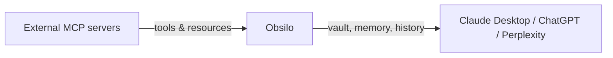

# MCP

The Model Context Protocol (MCP) is a standard for connecting AI agents to external tools and data sources. Obsilo is both client and server. It connects to external MCP servers, and it exposes the vault plus the memory and history layers to external agents like Claude Desktop, ChatGPT, and Perplexity.

## Two directions

On the left, Obsilo reaches out to MCP servers you have configured. A GitHub server that can search issues, a database server that can run queries, whatever tools those servers expose. They become available to the agent alongside its built-in tools.

On the right, Obsilo itself is the server. External clients connect to it and get access to the vault, the persistent memory layer, and the conversation history. Each call carries a `source_interface` tag (`obsilo`, `claude`, `chatgpt`, `perplexity`, `other`, `unknown`) so memory and history stay separable per surface. See [Unified Chat Memory](./unified-chat-memory.md) for the cross-surface UX.

## Client side

You configure external MCP servers in **Settings > Providers > MCP Servers**. Each server needs a transport type (stdio for local processes, Streamable HTTP for modern remote servers, or SSE as a fallback for older servers) and connection details.

When Obsilo connects to a server, it discovers available tools and resources through MCP's standard discovery protocol. Those tools appear in the agent's tool list alongside built-in tools. The agent calls them like any other tool and does not need to know they run in a separate process.

The MCP client handles reconnection automatically. If a server crashes or becomes unreachable, the client retries with exponential backoff. SSE transport is still supported as a fallback for older MCP servers that have not migrated to Streamable HTTP.

Resources, a second MCP concept alongside tools, are also supported. If an MCP server exposes resources like documentation files or database schemas, Obsilo can list and read them. The agent pulls in resource content as additional context when needed.

## Server side

The `McpBridge` (`src/mcp/McpBridge.ts`) runs an HTTP server on localhost (default port 27182) that speaks the MCP Streamable HTTP protocol. The current tool surface is organized in four tiers:

| Tier | Tools | What they do |
|------|-------|-------------|
| Read | `get_context`, `search_vault`, `read_notes`, `get_vault_note_metadata`, `get_vault_implicit_edges` | Retrieve vault, ontology, and structural information |
| Memory | `recall_memory`, `save_to_memory`, `update_memory` (deprecated) | Cross-surface memory access. `update_memory` is kept for legacy clients and routes to `save_to_memory` internally. |
| History | `save_conversation`, `close_conversation`, `search_history`, `sync_session` | Persist a conversation as a living document, or look up past chats |
| Write | `write_vault`, `execute_vault_op` | Create, edit, delete files; run any of ~60 vault operations (the list is generated from the tool registry at runtime) |

The `get_context` tool is meant to be called first in every conversation. It returns the user profile, memory, behavioral patterns, vault statistics, available skills, and rules. The same context Obsilo's internal agent gets from its system prompt. Under strict source isolation (Settings > Memory > Cross-Surface Sync), the response for non-`obsilo` callers omits memory, soul, skills, and rules; only vault stats and structural info come through.

All tool calls dispatch directly to Obsilo's services within Obsidian's renderer process. No IPC overhead. The HTTP handler calls the same functions the internal agent uses.

The `search_vault` tool on the MCP server uses the same knowledge layer pipeline described on the [knowledge layer](./knowledge-layer.md) page. External agents get the same retrieval (vector search, graph expansion, implicit connections, reranking) as the internal agent. The `write_vault` tool supports batch operations, so create, edit, append, and delete can happen in a single call. Per-call content caps and an aggregate cap protect against runaway writes.

## Living documents and source-interface tagging

Multiple `save_conversation` calls within 30 minutes from the same source interface append to a single thread (`thread-YYYY-MM-DD-{6-hex}`) instead of creating new conversations. Living documents are append-only. Memory extraction runs incrementally on the new turns rather than re-processing the whole thread.

Every persisted message carries the `source_interface` tag. The history sidebar groups conversations by source so you can answer "what did Claude Desktop and I work on yesterday?" separately from "what came in via ChatGPT?". The Memory tab in Settings has a Cross-Surface Sync section that controls whether memory writes from non-Obsilo surfaces are accepted, and whether reads from non-Obsilo surfaces see your full memory layer.

## Remote access

The local HTTP server is only reachable on your machine. For remote access (from Claude Desktop on a different device, or from the Claude web app), the `RelayClient` (`src/mcp/RelayClient.ts`) connects to a Cloudflare Workers relay.

The relay uses HTTP long-polling. The client polls for incoming requests, processes them locally, and sends responses back. Authentication uses a token embedded in the URL. No data is stored on the relay. It is a passthrough.

Remote access requires Obsidian to be running on your machine. The relay cannot access your vault on its own. It only forwards requests to the plugin.

The `RelayClient` handles the connection lifecycle: initial connection, reconnection with exponential backoff when the relay becomes unreachable, and clean shutdown when the plugin unloads. A callback notifies the Settings UI of the current tunnel URL so you can copy it into Claude Desktop's MCP configuration. Poll interval is bounded by the Cloudflare Workers Free Plan request budget; intervals and reconnect delays are named constants in the source.

## System context

External agents connecting via MCP do not automatically know how to behave. The `buildPrompts` function (`src/mcp/prompts/systemContext.ts`) generates context about your vault: size, structure, installed plugins, active rules. External agents receive this as part of the `get_context` response, which gives them enough background to be useful without manual setup.

## Practical use

You can use Claude Desktop as your primary interface while Obsilo handles the vault integration. Or you can run Obsidian as the IDE while ChatGPT, Perplexity, or any other MCP-aware client reads from the same memory layer. The protocol is the same in both directions.

The MCP server only runs while Obsidian is open. If you close Obsidian, external clients lose access until you reopen it. The relay client reconnects automatically when Obsidian comes back up.

## Session sync vs save_conversation

`save_conversation` is the canonical way external clients persist a turn. It supports living documents, source tagging, and incremental memory extraction.

`sync_session` is the legacy bulk path: an external client sends an entire transcript at the end of a conversation and Obsilo stores it as a single conversation. It is kept for clients that do not yet support per-turn `save_conversation`. Both paths apply per-message length caps and a maximum messages-per-call limit to bound resource use.

## Related

- [Unified Chat Memory](./unified-chat-memory.md): how cross-surface memory shows up in the UI.
- [Connectors guide](/guides/connectors): step-by-step setup for Claude Desktop, ChatGPT, and Perplexity.
- [Memory system](./memory-system.md): the memory and soul layers behind `recall_memory` and `save_to_memory`.
