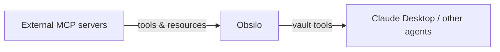

# MCP

The Model Context Protocol (MCP) is a standard for connecting AI agents to external tools and data sources. Obsilo acts as both client and server: it connects to external MCP servers, and it exposes your vault to external agents like Claude Desktop.

## Two directions

On the left: Obsilo reaches out to MCP servers you've configured. A GitHub server that can search issues. A database server that can run queries. Whatever tools those servers expose become available to the agent alongside its built-in tools.

On the right: Obsilo itself is the server. Claude Desktop connects to it and gets access to your vault: searching notes, reading files, writing content. Your Obsidian vault becomes a tool that any MCP-compatible agent can use.

## Client side

You configure MCP servers in Settings under Providers > MCP Servers. Each server needs a transport type (stdio for local processes, SSE for legacy remote servers, or Streamable HTTP for modern remote servers) and connection details.

When Obsilo connects to a server, it discovers available tools and resources through MCP's standard discovery protocol. Those tools appear in the agent's tool list alongside built-in tools. The agent calls them like any other tool and doesn't need to know they're running in a separate process.

The MCP client handles reconnection automatically. If a server crashes or becomes unreachable, the client retries with exponential backoff. SSE transport is still supported as a fallback for older MCP servers that haven't migrated to Streamable HTTP.

Resources (a second MCP concept alongside tools) are also supported. If an MCP server exposes resources like documentation files or database schemas, Obsilo can list and read them. The agent pulls in resource content as additional context when needed.

## Server side

The `McpBridge` (`src/mcp/McpBridge.ts`) runs an HTTP server on localhost (default port 27182) that speaks the MCP Streamable HTTP protocol. It exposes six tools organized in three tiers:

| Tier | Tools | What they do |
|------|-------|-------------|
| Read | `get_context`, `search_vault`, `read_notes` | Retrieve information without modifying anything |
| Session | `sync_session`, `update_memory` | Manage conversation history and persistent memory |
| Write | `write_vault`, `execute_vault_op` | Create, edit, delete files; run vault operations |

The `get_context` tool is mandatory. External agents should call it first in every conversation. It returns the user profile, memory, behavioral patterns, vault statistics, available skills, and rules, the same context that Obsilo's internal agent gets from its system prompt.

All tool calls dispatch directly to Obsilo's services within Obsidian's renderer process. No IPC overhead. The HTTP handler calls the same functions the internal agent uses.

The `search_vault` tool on the MCP server uses the same knowledge layer pipeline described on the [knowledge layer](./knowledge-layer.md) page. External agents get the same 4-stage retrieval (vector search, graph expansion, implicit connections, reranking) as the internal agent. The `write_vault` tool supports batch operations: create, edit, append, and delete in a single call.

## Remote access

The local HTTP server is only reachable on your machine. For remote access (from Claude Desktop on a different device, or from the Claude web app), the `RelayClient` (`src/mcp/RelayClient.ts`) connects to a Cloudflare Workers relay.

The relay uses HTTP long-polling. The client polls for incoming requests, processes them locally, and sends responses back. Authentication uses a token embedded in the URL. No data is stored on the relay; it is a passthrough.

Remote access requires Obsidian to be running on your machine. The relay cannot access your vault on its own; it only forwards requests to the plugin.

The `RelayClient` handles connection lifecycle: initial connection, reconnection with exponential backoff when the relay becomes unreachable, and clean shutdown when the plugin unloads. A callback notifies the Settings UI of the current tunnel URL so you can copy it into Claude Desktop's MCP configuration.

## System context

External agents connecting via MCP don't automatically know how to behave. The `buildPrompts` function (`src/mcp/prompts/systemContext.ts`) generates context about your vault: size, structure, installed plugins, active rules. External agents receive this as part of the `get_context` response, giving them enough background to be useful without manual setup.

## Practical use

You can use Claude Desktop as your primary interface while Obsilo handles the vault integration. Or you can extend Obsilo by connecting it to specialized MCP servers (code analysis, web scraping, calendar integration). The protocol is the same in both directions.

The MCP server only runs while Obsidian is open. If you close Obsidian, Claude Desktop loses access to the vault tools until you reopen it.

## Session sync

When you use Obsilo through Claude Desktop, the conversation history lives in Claude Desktop, not in Obsidian. Calling `sync_session` at the end of a conversation replicates the messages into Obsidian's conversation store. You can then browse the conversation in Obsidian's history panel, and the memory system can extract patterns from it.

Session sync is marked as mandatory in the tool description. Claude Desktop is instructed to call it at the end of every conversation. In practice, it's best-effort. If Claude Desktop terminates the conversation without calling it, the session is simply missing from Obsidian's history.
