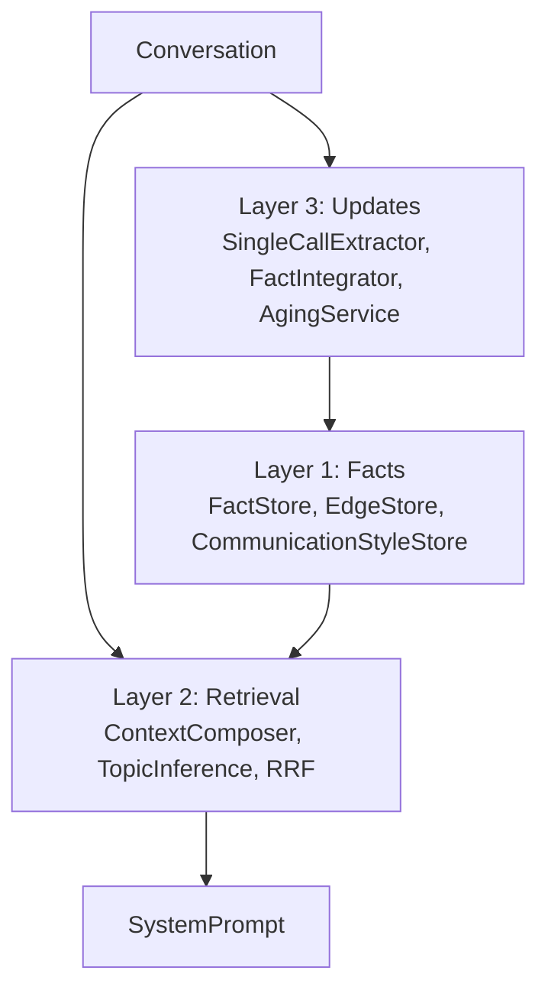
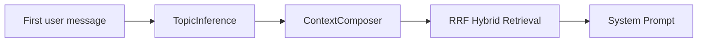
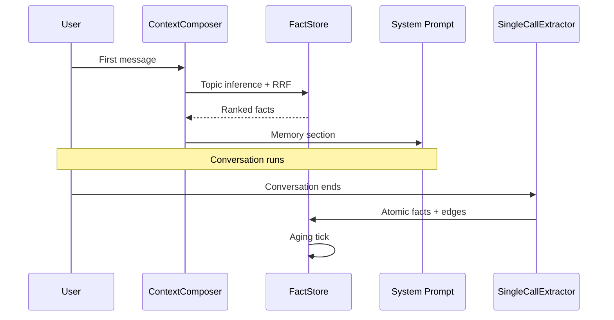

# Memory

Without memory, every conversation starts from zero. You re-explain your preferences, your projects, your writing style. Vault Operator's memory keeps those things across conversations and surfaces them at the moment they matter.

The current memory subsystem is **Memory v2**. It replaces the older five-file Markdown memory (a fixed set of `user-profile.md`, `projects.md`, `patterns.md`, `soul.md`, `knowledge.md`) with a single fact-oriented store, dynamic retrieval per conversation, and an update pipeline that ages facts gracefully instead of overwriting them.

## Why Memory v2

The legacy system had five fixed Markdown files with hard character caps. That structure had three problems.

- **Categories did not match reality.** A note like "Sebastian prefers concise PRs" is part user preference, part workflow pattern, part project context. It went into one bucket and lost the others.
- **No temporal dimension.** Facts had no creation date, no last-confirmed timestamp, no use count. Old preferences sat next to current ones with equal weight.
- **No conflict resolution.** Re-extracting the same fact from a new conversation would either duplicate it or silently overwrite the previous version.

Memory v2 keeps facts as atomic statements with metadata. It retrieves them dynamically based on what the conversation is about. It ages them organically based on how often they get used and confirmed.

## The Three-Layer Memory Architecture (3LMA)

3LMA is the internal structure of Memory v2. One storage backend, three responsibilities.

The layers do not map to separate databases or services. They are responsibilities inside the `src/core/memory/` directory, with clear boundaries so storage, retrieval, and updates can evolve independently.

### Layer 1: Facts

Layer 1 stores knowledge atomically. The unit is a **fact**: a single short statement like "Sebastian prefers TypeScript over JavaScript for new projects" or "Default deploy path is the iCloud plugins folder".

Each fact in `FactStore` carries metadata that the legacy markdown files never had:

| Field | Purpose |
|-------|---------|
| `text` | The atomic statement itself |
| `embedding` | Vector for semantic retrieval |
| `topics` | LLM-assigned labels like `coding`, `obsilo-project`, `personal` |
| `importance` | A 0.0 to 1.0 score that decays over time |
| `confirmation_count` | How often this fact was re-stated in later conversations |
| `last_confirmed_at` / `last_used_at` | Timestamps for aging |
| `source_interface` | Which AI tool the fact came from (`obsilo`, `claude-code`, `chatgpt`, ...) |
| `superseded_by` | Pointer to the fact that replaced this one |

Three sibling stores complete Layer 1:

- **`EdgeStore`** holds typed relations between facts (`update`, `extend`, `derive`, `contradict`). When a fact is replaced, the old version is kept and an edge points to the new one. You see history, not just the latest snapshot.
- **`CommunicationStyleStore`** replaces the legacy `soul.md`. Multiple styles can coexist: a coding-context style, a personal-context style, a quick-notes style. The `ContextComposer` picks the right one for the current conversation.
- **Topic registry** tracks every topic that has ever been used, with a centroid embedding so future conversations can be matched against known topics in milliseconds without an LLM call.

### Layer 2: Retrieval

Layer 2 decides what goes into the system prompt for the current conversation. It runs at the start of every conversation and on demand via the `recall_memory` tool.

**Topic inference** runs locally. The first user message is embedded once, then compared by cosine similarity against every centroid in the topic registry. Topics above a threshold form a per-conversation **soft topic-lock**: facts tagged with those topics get a retrieval boost. No LLM call, sub-50ms.

**Hybrid retrieval (RRF)** combines three signals when picking which facts to surface:

| Signal | What it scores |
|--------|----------------|
| Semantic | Cosine similarity between the query embedding and each fact's embedding |
| Keyword (FTS) | SQLite full-text search on the fact text |
| Graph | One-hop walk over `fact_edges` from already-matched facts |

Reciprocal Rank Fusion merges the three rankings into one ordered list. The composer fills the memory section of the system prompt up to a token budget, with importance and recency as tie-breakers.

The legacy "five files, 800 chars each" cap is gone. The composer now allocates the same overall budget but distributes it where the conversation needs it. A coding conversation sees more `coding`-tagged facts; a personal conversation sees more identity facts.

### Layer 3: Updates

Layer 3 keeps the store fresh. It runs after a conversation ends (if the conversation is memory-eligible).

The pipeline has three steps.

1. **Single-call extraction.** One LLM call to `SingleCallExtractor` produces a list of atomic fact candidates with topics, importance, kind (`fact`, `preference`, `identity`, `event`), and an edge relation (`new`, `update`, `extend`, `derive`). The legacy version used two separate LLM calls and cost roughly twice as much per conversation.

2. **Lazy conflict resolution.** `FactIntegrator` only runs an LLM-based conflict check when an incoming fact has both high cosine similarity and topic overlap with an existing fact. About ten percent of inserts trigger a check, instead of all of them. Conflicts produce an edge of kind `update` or `contradict` and a new version of the fact, never an in-place overwrite.

3. **Organic aging.** `AgingService` runs in the background. Each fact's importance decays on a half-life that depends on its kind:

| Kind | Half-life |
|------|-----------|
| `identity` | 180 days |
| `fact` | 90 days |
| `preference` | 90 days |
| `event` | 14 days |

Confirming a fact (re-extracting it, or hitting it during retrieval) refreshes `last_used_at` and adds a small importance boost. Facts that no one references for months sink slowly to the bottom of retrieval, but are never deleted.

## How memory flows in a conversation

Two writes happen for every memory-eligible conversation: one when the conversation starts (retrieval), one when it ends (extraction). Everything else, the embedding model, the SQLite store, the topic registry, runs locally inside the plugin. No fact ever leaves your machine except as part of the prompt sent to your configured AI provider.

## Where it lives

Memory v2 stores everything in `memory.db`, a SQLite database in the plugin folder. The schema includes:

| Table | Purpose |
|-------|---------|
| `facts` | Atomic statements with metadata |
| `fact_edges` | Typed relations between facts (`update`, `extend`, `derive`, `contradict`) |
| `communication_styles` | Context-matched style descriptors that replace the single soul |
| `known_topics` | Topic labels with centroid embeddings for fast inference |
| `memory_audit` | Append-only log of every state change for debuggability |
| `conversation_threads` | Threads that span multiple sessions, with a memory-eligible flag |
| `memory_source_notes` | Vault notes that the user marked as memory sources (FEAT-03-25) |

The history of conversations lives in a sibling database, `history.db`. It powers the [history sidebar](../guides/chat-interface) and the `search_history` tool.

## What the user sees

The settings tab still calls memory by its tier names (Session, Long-term, Soul) so the UI stays familiar. Underneath, the model is unified: every "remembered thing" is a fact in the same store. The "Memory" tab now also exposes a fact viewer, a soul viewer, and a soft-delete option for individual facts.

You can mark vault notes as memory sources. Vault Operator extracts facts from them through the same single-call pipeline, with `source_uri='vault://...'`. Edits to the note re-trigger extraction in the background. This turns long-form documents like `personal-profile.md` or `project-roadmap.md` into structured facts without losing the original document as the canonical source.

## Across AI tools

Every fact carries a `source_interface` tag (`obsilo`, `claude-ai`, `claude-code`, `chatgpt`, `perplexity`, `unknown`). The same MCP server that exposes Vault Operator's tools to other AI clients also writes their conversations and facts into the same store. This is the foundation for **Unified Chat Memory (UCM)**, which is documented separately in [Unified Chat Memory](./unified-chat-memory).

## Onboarding

New users start with an empty fact store. The `OnboardingService` runs a short conversation that captures name, language, and primary use case, then writes the answers as identity-kind facts with a high initial importance and a long half-life. From there the store grows organically.

You can skip onboarding. The 3LMA pipeline does not require any seed facts to function; retrieval just returns an empty memory section until the first real conversation gets extracted.

## Token economics

The memory section of the system prompt has a soft token budget (configurable). The composer fills it greedily by RRF score until the budget is exhausted, then truncates. The legacy cap of "4000 characters across five files" is gone, replaced by a budget that the composer can reallocate per conversation.

Cold memory, accessible through the `recall_memory` tool, sits outside this budget. The agent only loads it when it explicitly searches for something. This is how facts you have not touched in months stay reachable without paying a token cost on every conversation.
