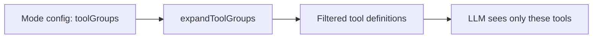

# Modes

A mode defines what the agent can do and how it talks. Each mode has a name, a role definition, a set of tool groups, and optional custom instructions. Switch modes, and the agent's capabilities change immediately.

## Two built-in modes

Ask is read-only. Tool groups: `read`, `vault`, `agent`. The agent can search, read files, answer questions, and explore the vault. It cannot create, edit, move, or delete anything. When the user asks for a write operation, the agent calls `switch_mode` to escalate to Agent mode.

Agent has full access. Tool groups: `read`, `vault`, `edit`, `web`, `agent`, `mcp`, `skill`. It can do everything Ask can, plus write files, browse the web, spawn sub-agents, call MCP servers, and run plugin commands.

These two modes are defined in `src/core/modes/builtinModes.ts`.

## Custom modes

You can create your own modes beyond Ask and Agent. A custom mode has a slug, a display name, a role definition, one or more tool groups, and optional custom instructions.

Custom modes are stored at two levels:

- Global: in `~/.obsidian-agent/modes.json`, available across all vaults. Managed by `GlobalModeStore` (`src/core/modes/GlobalModeStore.ts`).
- Vault-local: in the plugin's settings for a specific vault. Scoped to that vault only.

If a vault-local mode has the same slug as a built-in, the vault version replaces the built-in. This lets you customize the default behavior without losing the originals.

## How tool filtering works

Each mode declares which tool groups it uses. The `ModeService` (`src/core/modes/ModeService.ts`) expands those groups into individual tool names and passes only those tools to the LLM in the API request.

The model cannot call a tool it does not see. If your custom mode enables only `read` and `vault`, the model has no write tools in its schema. This is not a runtime check. The tools are simply absent from the request.

Users can further restrict tools within a mode through `setModeToolOverride()`. Overrides can only remove tools, never add ones outside the mode's groups. You can narrow access but not escalate it.

Web tools have an extra gate: when `webTools.enabled` is false, `web_fetch` and `web_search` are stripped from every mode's tool set, regardless of configuration.

## Mode switching

The agent or the user can switch modes mid-conversation. The `switch_mode` tool persists the new active mode and triggers a system prompt rebuild. Tool definitions are re-filtered for the new mode, so the next iteration sees a different set of capabilities.

Ask mode uses this for escalation. When someone asks "create a note about X," the agent recognizes it cannot write and calls `switch_mode('agent')` to hand off.

## Multi-agent mode propagation

When a parent agent spawns a subtask via `new_task`, it specifies which mode the child runs in. The child inherits mode restrictions from the parent. A common pattern: Agent mode spawns an Ask-mode subtask for research, keeping the child read-only while the parent handles writes.

The child cannot escalate beyond its assigned mode. If it was given Ask, it stays in Ask.

## ModeConfig

Each mode is a `ModeConfig` object with these fields:

| Field | Purpose |
|-------|---------|
| `slug` | Unique identifier (e.g., `ask`, `agent`, `researcher`) |
| `name` | Display name in the UI |
| `toolGroups` | Which tool groups the mode can access |
| `roleDefinition` | Injected into the [system prompt](/concepts/system-prompt) as the mode's identity |
| `customInstructions` | Extra instructions appended to the system prompt |
| `whenToUse` | Description of when this mode is appropriate |
| `source` | `built-in`, `global`, or `vault` |

The `ModeService` resolves the active mode by checking sources in order: built-in, then global, then vault-local. It falls back to Ask if the saved slug no longer exists.
