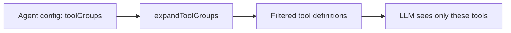

# Agents (Modes)

An agent (called a "mode" internally and in older docs) defines what the assistant can do and how it talks. Each one has a name, a role definition, a set of tool groups, and optional custom instructions. Switch the active agent, and its capabilities change immediately.

In v2.11 the user-facing label changed from "Modes" to "Agents". The backend type name `ModeConfig`, the slug `agent`, and persisted settings keys keep their historical names for back-compat. The `switch_mode` tool was renamed to `switch_agent` at the same time.

:::info Skills cover most of what custom modes used to
In practice, [skills](/guides/skills-rules-workflows) have absorbed most of the day-to-day "switch into a different working style" use case. Skills are scoped to a task type, can be triggered by a slash command, and do not require a global agent switch. The agent system below is still in place and still useful for hard permission boundaries via tool-group restrictions, but custom agents have become rare. If you find yourself reaching for a custom agent, check whether a skill solves it first.
:::

## One built-in agent

The Default agent (`slug: 'agent'`) has full access. Tool groups: `read`, `vault`, `edit`, `web`, `agent`, `mcp`, `skill`. It reads, writes, searches, browses the web, spawns sub-agents, calls MCP servers, and runs plugin commands.

The previous read-only "Ask" mode was removed on 2026-05-18. The same read-only behavior is now achievable via a Custom Agent with restricted tool groups (typically `read`, `vault`, `agent`). The Default agent's tool catalog is rich enough that the two-mode split just confused users.

The built-in agent is defined in `src/core/modes/builtinModes.ts`.

## Custom agents

You can create your own agents beyond the Default agent. A custom agent has a slug, a display name, a role definition, one or more tool groups, and optional custom instructions.

Custom agents are stored at two levels. Global agents live in `~/.obsidian-agent/modes.json` and are available across all vaults, managed by `GlobalModeStore` (`src/core/modes/GlobalModeStore.ts`). Vault-local agents live in the plugin's settings for a specific vault and are scoped to that vault only.

If a vault-local agent has the same slug as a built-in, the vault version replaces the built-in. This lets you customize the default behavior without losing the original.

## How tool filtering works

Each agent declares which tool groups it uses. The `ModeService` (`src/core/modes/ModeService.ts`) expands those groups into individual tool names and passes only those tools to the LLM in the API request.

The model cannot call a tool it does not see. If your custom agent enables only `read` and `vault`, the model has no write tools in its schema. This is not a runtime check. The tools are simply absent from the request.

Users can further restrict tools within an agent through `setModeToolOverride()`. Overrides can only remove tools, never add ones outside the agent's groups. You can narrow access but not escalate it.

Web tools have an extra gate. When `webTools.enabled` is false, `web_fetch` and `web_search` are stripped from every agent's tool set, regardless of configuration.

## Agent switching

The assistant or the user can switch agents mid-conversation. The `switch_agent` tool persists the new active agent and triggers a system prompt rebuild. Tool definitions are re-filtered for the new agent, so the next iteration sees a different set of capabilities.

A custom read-only agent uses this for escalation. When someone asks "create a note about X" inside a read-only agent, the assistant recognizes it cannot write and calls `switch_agent` with the slug of a write-capable agent to hand off.

## Multi-agent propagation

When a parent task spawns a subtask via `new_task`, it specifies which agent the child runs in. The child inherits the agent's restrictions from the parent. A common pattern is the Default agent spawning a read-only-agent subtask for research, keeping the child read-only while the parent handles writes.

The child cannot escalate beyond its assigned agent. If it was given a read-only agent, it stays in that agent.

## ModeConfig

Each agent is a `ModeConfig` object with these fields:

| Field | Purpose |
|-------|---------|
| `slug` | Unique identifier (e.g., `agent`, `researcher`) |
| `name` | Display name in the UI |
| `toolGroups` | Which tool groups the agent can access |
| `roleDefinition` | Injected into the [system prompt](/concepts/system-prompt) as the agent's identity |
| `customInstructions` | Extra instructions appended to the system prompt |
| `whenToUse` | Description of when this agent is appropriate |
| `source` | `built-in`, `global`, or `vault` |

The `ModeService` resolves the active agent by checking sources in order: built-in, then global, then vault-local. It falls back to the Default agent if the saved slug no longer exists.
