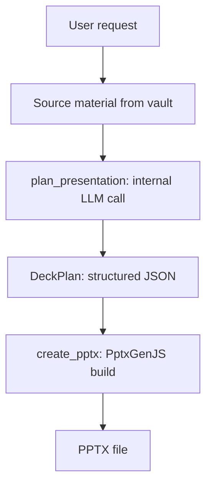

# Office pipeline

:::warning Beta on the creation side
The reading side of the office pipeline (parsing PPTX, DOCX, XLSX, PDF into structured text the agent can use as context) is production-ready and powers the chat-attachment, `@`-mention, and `/ingest` paths. The creation side (writing those formats back) is beta. It produces working files, but the visual quality of generated PPTX is constrained by a small set of fixed layouts. Real corporate template cloning is not active in this version. See the [office documents guide](/guides/office-documents) for the user-facing implications.
:::

Vault Operator can create PowerPoint, Word, and Excel files directly in your vault. It can also read them, extracting text and structure from office documents to use as context in conversations.

## Document creation

Three built-in tools handle file creation: `create_pptx`, `create_docx`, and `create_xlsx`. Each writes binary output to the vault through a shared `writeBinaryToVault()` utility that enforces path-traversal protection.

DOCX and XLSX generation are straightforward. The `docx` library handles Word output (headings, paragraphs, bullet lists, numbered lists, tables). The `exceljs` library handles Excel output (sheets, headers, rows, formulas, column widths). Both produce clean, reliable files.

PPTX is where the interesting architecture lives, and also where the limitations are.

## How PPTX generation actually works

The current implementation uses [PptxGenJS](https://gitbrent.github.io/PptxGenJS/) as the generator. Five fixed layouts are available: title, section, content, two-column, closing. The agent picks a layout per slide and fills it with title, subtitle, body, bullets, table, image, or speaker notes as appropriate. Theme parameters (primary color, accent color, background color, text color, font family) apply across the deck for a coherent look.

### What the theme catalog does

The `TemplateCatalogLoader` (`src/core/office/pptx/TemplateCatalog.ts`) reads a JSON catalog that describes the available layouts and their content slots for each theme. Three default themes ship bundled: executive (dark), modern (light), minimal (black and white). User themes can be added under `.vault-operator/themes/{theme_name}/`, but they describe a layout vocabulary, not a cloned PPTX master.

This catalog feeds `plan_presentation`. The internal LLM call sees the layout vocabulary as structured input and produces a `DeckPlan` that respects it. The plan is what `create_pptx` consumes.

### What the catalog does not do

It does not replace pptx-automizer. The original design (ADR-032 to ADR-048) intended to clone real corporate `.pptx` files, preserve their slide masters, and inject content into existing placeholders. After 50+ iterations the approach was retired in ADR-049 because the corner cases (group shapes, conditional layouts, master-slide inheritance, font fallback) consistently produced broken output. The plugin now produces a clean default deck with your theme colors, but it does not reproduce a corporate `.pptx` design.

This is the single biggest constraint on the current PPTX path. If you need brand-matched output, generate a draft and finish the polish manually in PowerPoint.

## The plan_presentation step

The important part of the PPTX pipeline is what happens before generation. Raw source material (meeting notes, research, bullet points) has to be turned into structured slide content. Asking the agent to do this inline, while it is also managing tool calls and conversation flow, produces mediocre results.

The `plan_presentation` tool (`src/core/tools/vault/PlanPresentationTool.ts`) solves this with a dedicated internal LLM call. It is a tool that calls the LLM itself, separate from the main conversation:

1. Read the source material and the theme catalog
2. Extract key messages from the source
3. Choose layouts for each slide from the catalog
4. Generate content for every populated slot (title, body, bullets, table, etc.)
5. Validate the plan (do all required slots have content? is the layout sequence sensible?)

The output is a `DeckPlan`, a structured JSON object that `create_pptx` consumes directly. Separating planning from generation lets you review and adjust the plan before committing to a file. You can ask the agent to show the plan, request changes ("move the financials section earlier", "add a slide about timeline"), and only generate the file once the plan looks right.

The internal LLM call is constrained. It receives the source material and the catalog as structured input, and has to produce output conforming to the DeckPlan schema. This is more reliable than asking the conversational LLM to produce the same structure inline, because the constrained call has a single focused task and no conversation history eating context.

## Tools referenced in skills but not yet shipped

The bundled office workflow skill mentions two tools that the current build does not ship:

- **`ingest_template`**: would derive a custom theme catalog from a user-provided `.pptx` file. Not present in this version. Use the three default themes.
- **`render_presentation`**: would render the generated PPTX to PNG images via headless LibreOffice for visual verification. The renderer library code exists (`src/core/office/pptxRenderer.ts` and `libreOfficeDetector.ts`), but no tool exposes it yet.

If you see these in skill text, treat them as future work, not as current capabilities.

## Document parsing (production-ready)

Reading office files is the reverse direction. The `parseDocument` function (`src/core/document-parsers/parseDocument.ts`) routes by file extension to specialized parsers:

| Format | Parser | What it extracts |
|--------|--------|------------------|
| PPTX / POTX | `PptxParser` | Slide text, speaker notes, slide order |
| DOCX | `DocxParser` | Paragraphs, headings, tables |
| XLSX | `XlsxParser` | Sheet names, cell data, formulas |
| PDF | `PdfParser` | Page text, basic structure |
| CSV / JSON | `CsvParser` / `parseJson` | Structured data |

Parsed content returns as structured text the agent can use as context. The agent reads a 50-slide presentation or a large spreadsheet through the extracted text, not the raw binary.

Document parsing runs in two places: the `read_document` tool (when the agent explicitly reads a file) and the `AttachmentHandler` (when you drag a file into the chat).

This side of the pipeline is mature. PPTX, DOCX, XLSX, and PDF parsing are the foundation for chat attachments, `@`-mentions, and the `/ingest` workflows.

## Why binary tools can't run in the sandbox

Office file generation requires libraries like JSZip that work with Buffer and stream objects. The sandboxed environment used for dynamic tools doesn't have access to these Node.js primitives. That is why `create_pptx`, `create_docx`, and `create_xlsx` are built-in tools running in the plugin's main process instead of sandbox-compatible dynamic tools. The same applies to document parsing, since the parsers need ArrayBuffer processing that only works in the main process.
