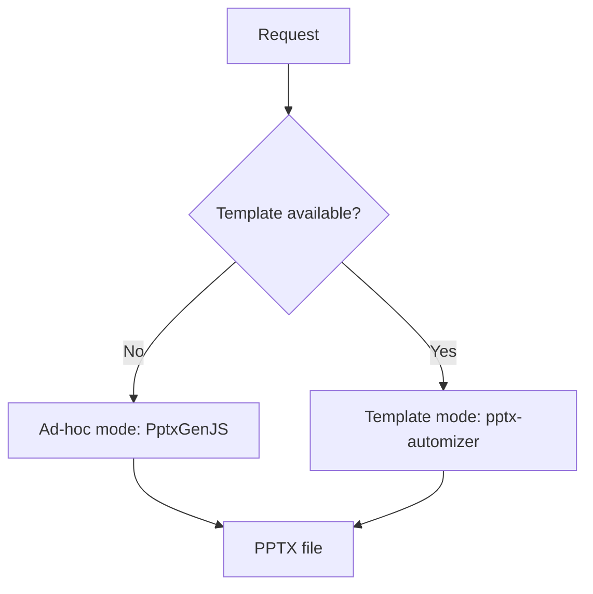

# Office pipeline

Vault Operator can create PowerPoint, Word, and Excel files directly in your vault. It can also read them, extracting text and structure from office documents to use as context in conversations.

## Document creation

Three built-in tools handle file creation: `create_pptx`, `create_docx`, and `create_xlsx`. Each writes binary output to the vault through a shared `writeBinaryToVault()` utility that enforces path-traversal protection.

DOCX and XLSX generation are straightforward. PPTX is where most of the complexity lives, because presentations have visual structure that matters.

## Two PPTX modes

Ad-hoc mode builds slides from scratch using PptxGenJS. The agent specifies slide content (titles, bullets, images) and the library generates a clean but generic presentation. The output uses sensible defaults for fonts and colors but won't match your company's brand guidelines. Good for quick drafts, or when no corporate template exists.

Template mode uses existing `.pptx` templates through pptx-automizer. Your corporate slide deck becomes the foundation. The agent fills in content while preserving the template's design, fonts, and layout. This is the mode that produces presentation-quality output.

Template mode depends on a catalog. The `TemplateCatalogLoader` (`src/core/office/pptx/TemplateCatalog.ts`) resolves templates from two locations: bundled defaults (executive, modern, minimal) and user-provided themes stored in `.obsilo/themes/{theme_name}/`. Each catalog is a JSON file describing available slide layouts, their shapes, and content capacity. User themes take priority over bundled ones, so you can override a default theme by creating one with the same name.

## The plan_presentation step

The important part of the PPTX pipeline is what happens before generation. Raw source material (meeting notes, research, bullet points) has to be turned into structured slide content. Asking the agent to do this inline, while it is also managing tool calls and conversation flow, produces mediocre results.

The `plan_presentation` tool (`src/core/tools/vault/PlanPresentationTool.ts`) solves this with a dedicated internal LLM call. It is a tool that calls the LLM itself, separate from the main conversation:

1. Read the source material and the template catalog
2. Extract key messages from the source
3. Select appropriate slide types from the catalog
4. Generate content for every non-decorative shape on each slide
5. Validate the plan against the catalog (do all required shapes have content? are shape names valid? are placeholders resolved?)

The output is a `DeckPlan`, a structured JSON object that `create_pptx` consumes directly. Separating planning from generation lets the agent review and adjust the plan before committing to a file. You can ask the agent to show the plan, request changes ("move the financials section earlier", "add a slide about timeline"), and only generate the file once the plan looks right.

The internal LLM call is constrained. It receives the source material and the catalog as structured input, and has to produce output conforming to the DeckPlan schema. This is more reliable than asking the conversational LLM to produce the same structure inline, because the constrained call has a single focused task and no conversation history eating context.

## Template catalog structure

Catalogs describe what each slide layout offers. For each slide type, the catalog lists available shapes with their names and content types (text, bullet list, image placeholder, chart data), required shapes that must have content, shape groups (elements that belong together visually), and special roles like section numbers or page indicators.

The agent selects slide types based on the content it needs to present. A "key findings" section might use a title + two-column layout, while a data summary might use a chart slide.

## Document parsing

Reading office files is the reverse direction. The `parseDocument` function (`src/core/document-parsers/parseDocument.ts`) routes by file extension to specialized parsers:

| Format | Parser | What it extracts |
|--------|--------|-----------------|
| PPTX/POTX | `PptxParser` | Slide text, speaker notes, slide order |
| DOCX | `DocxParser` | Paragraphs, headings, tables |
| XLSX | `XlsxParser` | Sheet names, cell data, formulas |
| PDF | `PdfParser` | Page text, basic structure |
| CSV/JSON | `CsvParser` / `parseJson` | Structured data |

Parsed content returns as structured text the agent can use as context. The agent reads a 50-slide presentation or a large spreadsheet through the extracted text, not the raw binary.

Document parsing runs in two places: the `read_document` tool (when the agent explicitly reads a file) and the `AttachmentHandler` (when you drag a file into the chat).

## Why binary tools can't run in the sandbox

Office file generation requires libraries like JSZip that work with Buffer and stream objects. The sandboxed environment used for dynamic tools doesn't have access to these Node.js primitives. That is why `create_pptx`, `create_docx`, and `create_xlsx` are built-in tools running in the plugin's main process instead of sandbox-compatible dynamic tools. The same applies to document parsing, since the parsers need ArrayBuffer processing that only works in the main process.
