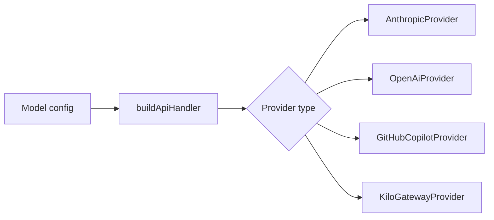

# Provider auth

Vault Operator supports Anthropic, OpenAI, GitHub Copilot, Kilo Gateway, Azure, OpenRouter, Ollama, LM Studio, and custom OpenAI-compatible endpoints. Each provider authenticates differently, but the agent talks to a single `ApiHandler` interface.

## The factory

The `buildApiHandler` factory (`src/api/index.ts`) takes a provider configuration and returns the right implementation. Anthropic gets its own provider class. GitHub Copilot and Kilo Gateway each have dedicated classes because their auth flows are non-standard. Everything else (OpenAI, Azure, OpenRouter, Ollama, LM Studio, custom endpoints) goes through `OpenAiProvider`, since they all speak the OpenAI API format.

The factory uses an exhaustive switch. Add a new provider type to the union and TypeScript forces you to handle it.

## Standard auth

Most providers use API key authentication. You paste your key in settings, and every request includes it as a Bearer token. The OpenAI-compatible providers (Ollama, LM Studio, OpenRouter, Azure, custom) all work this way, with minor variations in base URL and header format.

Ollama and LM Studio are local providers that run on your machine and don't need an API key. The `OpenAiProvider` makes the key optional when the base URL points to localhost. All HTTP requests go through Obsidian's `requestUrl` API rather than native `fetch`, which keeps the plugin compliant with Obsidian's review requirements.

## GitHub Copilot: three-stage token chain

GitHub Copilot authentication takes three stages, handled by `GitHubCopilotAuthService` (`src/core/security/GitHubCopilotAuthService.ts`).

First, the device code flow. The service requests a device code from GitHub, then shows you a URL and a short code. You open the URL in a browser, enter the code, and authorize the application. The service polls until authorization completes.

Second, the access token. GitHub returns a long-lived access token (valid ~30 days), which is stored securely and used to obtain short-lived Copilot tokens.

Third, the Copilot token. The access token is exchanged for a Copilot-specific token (valid ~1 hour) that gets sent with each API request. On expiry, the service refreshes it automatically using the access token.

A custom fetch wrapper (`getCopilotFetch()`) is injected into the OpenAI SDK for streaming chat completions because the SDK's built-in fetch doesn't handle Copilot's token format. The wrapper also handles token expiry: if a request fails with a 401, it triggers a refresh and retries.

You can provide a custom GitHub OAuth client ID in settings for enterprise GitHub instances. The default client ID targets github.com.

## Kilo Gateway: device auth + manual token

The `KiloAuthService` (`src/core/security/KiloAuthService.ts`) supports two auth modes. The device authorization flow works like GitHub Copilot: you get a code, authorize in a browser, and the service polls until complete. Alternatively, you paste an API token directly for simpler setups.

Both modes produce the same session state. The service stores user profile information and provider defaults (available models, rate limits) retrieved from the gateway API at `https://api.kilo.ai/api`.

## Encrypted storage

On desktop, `SafeStorageService` (`src/core/security/SafeStorageService.ts`) uses Electron's `safeStorage` API to encrypt credentials before storing them. That in turn uses the operating system's keychain (Keychain on macOS, Credential Manager on Windows, libsecret on Linux).

The service loads Electron via dynamic `require('electron')`, one of the few places where `require()` is allowed instead of ES imports, because Electron can only be loaded dynamically in the renderer process.

On mobile, Electron isn't available, so credentials fall back to Obsidian's standard plugin data storage. Less secure than OS-level encryption, but mobile Obsidian doesn't expose a keychain API.

## Concurrency

Both the Copilot and Kilo auth services include concurrency guards. If multiple requests trigger a token refresh at the same time, only one refresh runs, and the others wait on the same promise. That prevents duplicate auth requests and race conditions during high-frequency API usage.

## Adding a new provider

To add a provider that speaks the OpenAI API format: add the type to the `LLMProvider` union in `src/types/settings.ts`, handle it in the factory switch (it'll route to `OpenAiProvider`), and add a settings UI entry. If the provider needs a custom auth flow, create a dedicated provider class and auth service.

The relevant source files:

| File | What it does |
|------|-------------|
| `src/api/index.ts` | Factory function, provider routing |
| `src/api/types.ts` | `ApiHandler` interface, stream types |
| `src/api/providers/anthropic.ts` | Anthropic SDK integration |
| `src/api/providers/openai.ts` | OpenAI-compatible provider (handles 6+ providers) |
| `src/api/providers/github-copilot.ts` | Copilot provider with custom fetch |
| `src/api/providers/kilo-gateway.ts` | Kilo Gateway with device auth |
| `src/core/security/SafeStorageService.ts` | Electron keychain encryption |
| `src/core/security/GitHubCopilotAuthService.ts` | Three-stage Copilot auth |
| `src/core/security/KiloAuthService.ts` | Kilo device auth + manual token |
