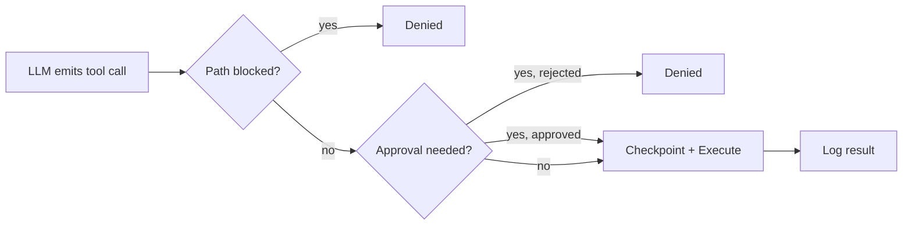

# Tool system

A tool is a function the LLM can call. Each tool has a name, a description, a JSON schema for its inputs, and an `execute` method. That is the entire abstraction.

The model never touches the vault directly. It describes _what_ it wants to do by emitting a tool call, and the tool system decides whether and how to carry it out.

## BaseTool

Every tool extends `BaseTool` (`src/core/tools/BaseTool.ts`):

```typescript
abstract class BaseTool<TName extends ToolName = ToolName> {
    abstract readonly name: TName;
    abstract readonly isWriteOperation: boolean;

    abstract getDefinition(): ToolDefinition;
    abstract execute(input: Record<string, unknown>, context: ToolExecutionContext): Promise<void>;

    protected validate(input: Record<string, unknown>): void { /* optional */ }
    protected formatError(error: unknown): string { /* wraps in <error> tags */ }
}
```

`isWriteOperation` is declared per tool, not inferred. The pipeline uses it to decide whether approval and checkpoints are needed. `getDefinition()` returns the JSON schema the LLM sees. `execute()` receives a `ToolExecutionContext` with callbacks for spawning subtasks, switching modes, signaling completion, and requesting approval.

## ToolRegistry

`ToolRegistry` (`src/core/tools/ToolRegistry.ts`) is a `Map<ToolName, BaseTool>`. Its constructor takes the plugin instance and optional service references (MCP client, sandbox executor, skill loader) and registers all internal tools at startup.

The registry has one job beyond storage: `getToolDefinitions(mode)` filters tools by the active mode's `toolGroups` setting. A mode that only enables the `read` group won't expose write tools to the LLM. The model cannot call what it cannot see.

## Tool groups

Tools are organized into six groups. Each group maps to a permission category.

| Group | What it contains | Effect on vault |
|-------|-----------------|-----------------|
| `read` | read_file, read_document, list_files, search_files | Never changes anything |
| `vault` | get_frontmatter, search_by_tag, get_vault_stats, semantic_search, query_base, ... | Read-only metadata and search |
| `edit` | write_file, edit_file, delete_file, move_file, create_pptx, generate_canvas, ... | Modifies or creates files |
| `web` | web_fetch, web_search | External network access |
| `agent` | attempt_completion, switch_mode, new_task, evaluate_expression, manage_skill, ... | Controls the agent's own behavior |
| `mcp` | use_mcp_tool | Calls external MCP servers |
| `skill` | execute_command, call_plugin_api, execute_recipe, ... | Runs Obsidian commands and plugin APIs |

When you create a [custom mode](/concepts/mode-system), you pick which groups it gets. An "Ask" mode with only `read` and `vault` is physically unable to write files.

## Execution pipeline

Every tool call flows through `ToolExecutionPipeline` (`src/core/tool-execution/ToolExecutionPipeline.ts`). Here is the path from invocation to result:



In detail:

1. The tool must exist in the registry. Unknown tool names return an error.
2. The `IgnoreService` checks whether any file path in the input is blocked or write-protected. If paths are blocked, the call is denied.
3. Write operations, MCP calls, sandbox evaluations, and subtask spawning go through `checkApproval()`. If no approval callback exists, the operation is denied. Fail-closed by design.
4. Before each write, a git snapshot captures the file's current content for undo.
5. The tool runs. The result is logged to a JSONL audit file via `OperationLogger`.

Read-only calls skip steps 3 and 4 entirely.

## Parallel execution

When the model emits multiple tool calls in a single response, read-safe tools run concurrently via `Promise.all()`. Write tools and control-flow tools always run sequentially. A single iteration can resolve four `read_file` calls in parallel instead of waiting for each one.

The distinction is simple: if `isWriteOperation` is false and the tool is in the `PARALLEL_SAFE` set, it runs concurrently. Everything else queues.

## Dynamic tools

Users and the agent can create tools at runtime. `DynamicToolFactory` (`src/core/tools/dynamic/`) builds a tool instance from a name, schema, and execute function. `DynamicToolLoader` persists definitions so they survive across sessions.

Dynamic tools go through the same `ToolExecutionPipeline` as built-in tools. A dynamic tool that writes files still needs approval and still gets checkpointed.

## Tool repetition detection

`ToolRepetitionDetector` (`src/core/tool-execution/ToolRepetitionDetector.ts`) catches the agent when it gets stuck calling the same tool with the same arguments in a loop.

It maintains a sliding window of the last 15 calls. If an identical `tool:input` combination appears 3 or more times, the call is blocked with a recoverable error. For search tools, it also checks semantic similarity. Queries with a Jaccard overlap above 0.5 that appear 3+ times are blocked too.

The error is recoverable on purpose. The agent sees the message and can try a different approach. The `consecutiveMistakeLimit` in `AgentTask` is the ultimate safety net if the agent keeps failing anyway.
