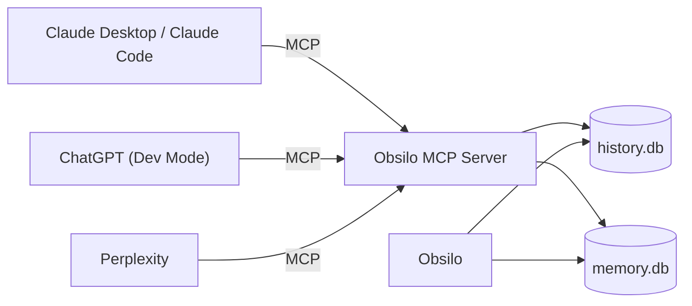

# Unified Chat Memory (UCM)

You probably do not stay inside one chat tool. A coding question goes to Claude Code, a research question to Perplexity, a long brainstorm to Claude.ai or ChatGPT, and the writing happens in Obsilo. Each tool has its own memory and its own history. Insights from one do not transfer to another.

Unified Chat Memory (UCM) is the layer in Obsilo that fixes this. It is not a separate product or a future plan. It is the cross-surface side of Memory v2 that ships today. UCM turns Obsilo into the single place where conversations from your other AI tools land, where their facts get stored, and where you search across all of them at once.

## What it does

UCM lets the other AI tools you use:

- **Save conversations into Obsilo's history.** A finished chat in Claude Code or ChatGPT lands in Obsilo's history sidebar, tagged with the source it came from.
- **Save facts into Obsilo's memory.** A single insight ("I prefer pnpm over npm", "the production database is on Neon") becomes a fact in the same store that powers Obsilo's own memory.
- **Recall facts and search history from inside the other tool.** The other tool can ask Obsilo "what do you remember about X?" and get back facts that were learned in any of the connected tools.
- **Continue a thread across tools.** A conversation that starts in Claude.ai and continues in Claude Code can be linked into a single cross-interface thread.

The connecting glue is the [Model Context Protocol](./mcp-architecture). Obsilo runs an MCP server. Any AI tool that speaks MCP (Claude Desktop, Claude Code, custom GPTs in Developer Mode, Perplexity Spaces with MCP support) can connect to it.

## How it works

Five MCP tools form the UCM contract. They are documented in the [tools reference](../reference/tools), but here is what each one does in plain language:

| Tool | What it does |
|------|--------------|
| `save_conversation` | Copies a chat from another tool into Obsilo's history sidebar |
| `save_to_memory` | Stores a single fact in Memory v2 |
| `close_conversation` | Marks a conversation finished so the next save starts a new one |
| `recall_memory` | Semantic search across all facts (optionally filtered by source) |
| `search_history` | Keyword search across all past conversations |

Each call carries a `source_interface` tag. The whitelist is fixed: `obsilo`, `claude-ai`, `claude-code`, `chatgpt`, `perplexity`, `unknown`. Unknown values fall back to `unknown` so a misconfigured connector cannot inject untagged data.

## Living documents

A "save the conversation" instruction in another tool rarely happens once. You usually keep talking, and you usually want the saved version to stay current.

UCM treats this as a living document. When the same source tool calls `save_conversation` again within 30 minutes from the same MCP session, the new turns are appended to the existing conversation instead of creating a fresh one. The other tool does not need to track the conversation ID. Obsilo detects the active conversation and either computes the delta from a full transcript or appends the new turns as-is.

If you want a clean break, the tool can call `close_conversation` and the next `save_conversation` starts a new entry.

You can turn living-document behaviour off globally or per call. **Settings > Memory > Cross-Surface Sync > Living-Document by default** controls the global default.

## Sync modes per source

Not every chat tool is private. ChatGPT and Perplexity are often shared with family members. Anything saved from those accounts could mix family context into your personal memory.

UCM ships with per-source sync modes to handle this:

| Source | Default | Why |
|--------|---------|-----|
| `obsilo` | Auto | Your own plugin chat |
| `claude-ai` | Auto | Personal account |
| `claude-code` | Auto | Personal CLI |
| `chatgpt` | Manual | Often family-shared |
| `perplexity` | Manual | Often family-shared |
| `unknown` | Manual | Anything that did not declare a source |

**Auto** runs the same Memory v2 extraction pipeline that Obsilo uses for its own conversations. Facts land in the store as soon as the conversation is closed.

**Manual** parks the conversation as "pending" in the history sidebar. Nothing flows into memory until you click "extract memory from this conversation" yourself. The conversation is still searchable with `search_history`, but it does not contaminate the fact store.

You can override per source in **Settings > Memory > Cross-Surface Sync > Sync mode per provider**.

## How history shows it

The history sidebar groups conversations into source tabs. Each tab only appears when at least one conversation of that source exists, so a fresh install with only Obsilo chats shows a clean single-tab view.

| Tab | Contents |
|-----|----------|
| All | Everything across sources |
| Obsilo | Plugin sidebar conversations |
| Claude.ai | Conversations saved from Claude Desktop |
| Claude Code | Conversations saved from the Claude Code CLI |
| ChatGPT | Conversations saved from ChatGPT |
| Perplexity | Conversations saved from Perplexity |
| Unknown | Conversations whose source did not match the whitelist |

Inside a tab, conversations are grouped by date (Today, Yesterday, This Week, Older). Each conversation shows its source, title, and a memory-eligible flag if it has been marked for extraction.

## Cross-interface threads

A topic does not always stay in one tool. You start in Claude.ai, switch to Claude Code to actually run the commands, then come back to Claude.ai for the writeup.

UCM links these as a **cross-interface thread**. The first `save_conversation` call returns a `cross_interface_thread_id`. The next call from a different source can pass that ID, and both conversations are linked in the history. You can then click any conversation in the thread to see all of them in order.

Threads also exist purely inside Obsilo. Every conversation in the sidebar can be linked into a thread without touching MCP at all.

## Memory across surfaces

Every fact in Memory v2 carries the `source_interface` tag of the tool that produced it. This means:

- A fact saved from Claude Code can surface in an Obsilo conversation.
- The other way around works too: a fact Obsilo learned about you can be recalled from Claude Desktop via `recall_memory`.
- You can filter recall to a single source. "What did Claude Code learn about my codebase?" is a single `recall_memory` call with `source_interface: 'claude-code'`.

The aging, conflict resolution, and retrieval rules from [Memory v2](./memory-system) apply uniformly. UCM does not have a separate "Claude memory" or "ChatGPT memory" silo. Everything lands in the same fact store, gets the same RRF ranking, and competes for the same context budget.

## What UCM is not

UCM is the **shared store and protocol** that makes cross-surface memory possible. It is not a hosted service, a separate app, or a future MCP package you install elsewhere. The Obsilo plugin is the server. Other tools are clients. If you uninstall Obsilo, UCM goes with it.

The shared facts and conversations live in your local `memory.db` and `history.db`. Nothing goes to a cloud, no telemetry, no third-party storage. UCM extends Obsilo's local-first design across tools without breaking it.

## Setup

To connect another AI tool to UCM, you need three things:

1. **Obsilo's MCP server enabled.** **Settings > MCP > Enable MCP server**. The plugin shows the connection URL and an auth token.
2. **A source-interface tag** configured per connector. In Claude Desktop's MCP config, set the connector to label its calls with `claude-ai` (or whichever source matches). The tag becomes part of every saved conversation and fact.
3. **Sync mode** chosen per source. The defaults err on the side of privacy. Switch a source from manual to auto only when you trust everything you say in that tool.

Detailed setup walks live in [Connectors](../guides/connectors).
