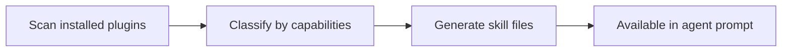

# Plugin discovery

Obsidian's plugin ecosystem is one of its strengths. Obsilo can work with your installed plugins, but first it needs to know what's available. VaultDNA handles this automatically.

## How scanning works

The `VaultDNAScanner` (`src/core/skills/VaultDNAScanner.ts`) reads `app.plugins.manifests` on startup, which lists all installed plugins (both enabled and disabled). For each plugin, it extracts:

- The plugin's name, version, and description
- All registered commands
- Whether the plugin is currently enabled

Commands are the important part. They're the primary way Obsidian plugins expose functionality, and the agent interacts with them via the `execute_command` tool.

The scanner distinguishes between core plugins (shipped with Obsidian) and community plugins (installed from the community registry or manually). Core plugins have stable, well-documented command IDs. Community plugins vary widely in quality and naming conventions.

## Classification

Not every command is useful to an agent. The scanner filters out UI-only commands that don't make sense in a headless context: sidebar toggles, "show settings" dialogs, "focus panel" actions. The filtering uses pattern matching against prefixes like `toggle`, `show-`, `focus`, and suffixes like `-panel`, `-sidebar`, `-settings`.

After filtering, each plugin is classified by how many agent-usable commands it has. A plugin like Dataview with many queryable commands gets a high classification. A plugin that only registers a "toggle sidebar" command is classified as UI-only. Plugins with zero usable commands are still recorded in the vault DNA but don't get skill files.

## Skill file generation

For each plugin with usable commands, the scanner generates a `.skill.md` file at `.obsidian-agent/plugin-skills/`. These skill files are Markdown documents that describe the plugin's capabilities in a format the agent can understand. They list available commands, describe what each one does, and provide usage hints.

The generated skills are skeleton quality: structural information from the plugin manifest and commands, but no LLM-generated descriptions or usage examples. This is intentional. Generation runs entirely offline, with no network calls and no LLM involvement. Accuracy is limited to what the manifest provides.

Core Obsidian plugins (daily notes, templates, canvas, etc.) get better treatment. The scanner includes a `CorePluginLibrary` with hand-written definitions for built-in plugins, so their skill files have more detail than what manifest parsing alone produces.

## Vault DNA persistence

Scan results are persisted as `vault-dna.json` in `.obsidian-agent/`. This avoids rescanning on every startup. The scanner polls for changes at a regular interval, comparing the current enabled plugins against its last known state. When you enable or disable a plugin, it detects the change and updates both the DNA file and the generated skill files.

The polling interval is short enough that changes are picked up within seconds. If you install a new community plugin and enable it, the next conversation will already know about it.

## Capability gap resolution

Sometimes the agent hits a task it can't handle with built-in tools. The `CapabilityGapResolver` (`src/core/skills/CapabilityGapResolver.ts`) searches the vault DNA for plugins that might help.

When the agent calls the `resolve_capability_gap` tool with a description like "I need to create a Kanban board", the resolver extracts keywords, scans the DNA for matching plugins, and returns either a match (with the relevant commands) or a suggestion to install a community plugin.

This is best-effort. It works well for plugins whose names and command descriptions clearly indicate their purpose. It won't find a match if the plugin's metadata is vague or the capability requires a plugin that isn't installed.

## Runtime skill metadata

Beyond the persisted skill files, the scanner maintains an in-memory list of `PluginSkillMeta` objects. These contain the plugin ID, classification, and command list in a structured format for injection into the system prompt. The agent knows at conversation start which plugins are available and what they can do, without reading every skill file.

## What works and what doesn't

Plugin discovery works best for plugins that expose their functionality through commands with descriptive names. The Obsidian Tasks plugin, for example, registers commands like `tasks:toggle-done` and `tasks:create-or-edit` that clearly communicate what they do.

It works less well for plugins that operate through UI interactions rather than commands. A plugin that adds a custom view type but doesn't register any commands is invisible to the agent. The scanner records its existence, but the agent can't do anything with it.

Plugins that require configuration (API keys, file paths, specific settings) before they work are another challenge. The scanner can detect the plugin and its commands, but it can't know whether the plugin is properly configured. The agent might try to use a command and get an error because the plugin hasn't been set up yet.

## Relationship to the skill system

Plugin skills are one category in a broader skill system. Obsilo has three sources of skills:

1. Plugin skills (generated by VaultDNAScanner, stored in `.obsidian-agent/plugin-skills/`)
2. User skills (written by you or the agent, stored in `.obsidian-agent/skills/`)
3. Built-in skills (bundled with the plugin)

All three types are Markdown files with the same structure. The agent doesn't distinguish between them at runtime. They're all loaded into the system prompt based on relevance to the current conversation. The distinction matters for management: plugin skills are regenerated automatically when plugins change, user skills persist until you delete them, and built-in skills update with plugin releases.
